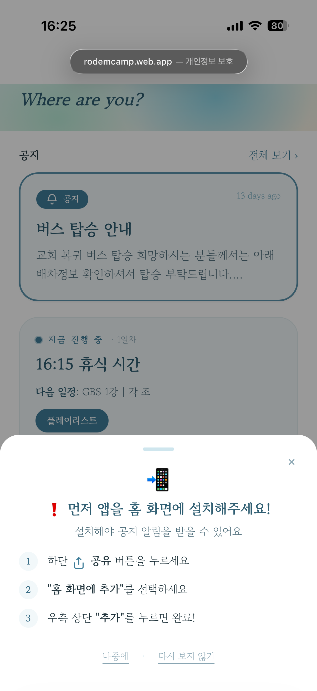

# Convene — 제품 케이스 스터디

> 다중일 오프라인 행사(워크숍·수련회·캠프)용 설치형 컴패니언 PWA
> **첫 배포:** 로뎀나무교회 청년대학부 여름말씀캠프 (2026.7.29–8.1, 3박 4일, 참가자 96명)
> **역할:** 기획·디자인·개발·운영·측정 단독 수행 · **상태: 배포 및 운영 완료**
> Live: https://rodemcamp.web.app · 개요: [README](README.md) · 디자인 기록: [DESIGN.md](DESIGN.md)

이 문서는 의사결정 기록이다. 산출물의 구성은 [README](README.md)에 정리했으며, 여기에는 결정의 근거와 사전 가설의 검증 결과를 기록한다.

---

## 요약

다일간 진행되는 오프라인 캠프에서 공지·일정·자료가 메신저와 인쇄물에 분산되어 전달되지 않는 문제를, **QR 설치형 PWA와 운영진 공지의 실시간 푸시**로 해결했다. 앱스토어 심사 없이 배포하고 웹 배포만으로 갱신하며, 행사별 설정은 단일 파일로 분리해 재사용 가능하도록 구성했다.

**결과는 항목별로 달랐다.** 푸시 권한 허용률 98%, 3일 이상 방문 81%, 공지 열람(1회 이상) 94%로 세 지표는 목표를 달성했고 설치율은 89%로 목표 90%에 근접 미달했다. 다만 **개별 공지의 도달률은 평균 19%**에 그쳤다. 채널을 앱으로 옮긴 것만으로 "공지가 묻히는" 문제가 해결되지는 않았고, 도달을 만든 것은 푸시가 아니라 상시 노출된 고정 공지(81%)였다.

또한 이 수치는 **최초 집계를 한 차례 폐기한 뒤 얻은 것**이다. 익명 로그인 구조에서 재설치·기기 추가마다 새 uid가 생성되어, 최초 집계는 uid를 사람으로 간주하고 있었다. 설치율은 61%, 1일차 이후 이탈은 55%로 나왔으나 둘 다 실제 현상이 아니라 집계 방식이 만든 수치였다. 닉네임 기준 병합·운영진 분리·기간 기준 수정을 거쳐 재산출한 결과 설치율 89%, DAU 감소폭 14%로 바뀌었다.

사후 익명 설문(응답 46명 / 96명)에서는 앱이 카톡보다 편했다는 응답이 88%, 재사용 의향이 100%였다. 도달률이 낮았던 원인도 확인됐다 — 41%가 "알림은 받았지만 제목만 보고 넘겼다"고 답해, 미수신이 아니라 미개봉이었다.

성과 수치와 함께 확인한 사항은 **결정과 측정의 연관성**이다. 진입 마찰을 제거하기 위해 익명 로그인을 선택한 대가가 지표의 분모였다는 점을 캠프 종료 후 집계 단계에서 확인했다.

---

## 1. 배경과 문제

이 문제 정의는 이전 캠프를 직접 운영하며 반복적으로 관찰한 내용과, 임원진 회의 및 참가자·운영진과의 대화에서 매년 제기된 사항을 근거로 한다.

- **공지가 묻힌다** — 단체 카톡방은 알림을 꺼둔 참가자가 많아 공지의 도달 자체가 보장되지 않는다. 확인한 경우에도 이후 대화에 밀려 내려가 필요한 시점에 다시 찾기 어렵고, 운영진은 동일한 공지를 반복해서 게시하게 된다.
- **정보가 흩어진다** — 일정은 인쇄물, 방배정은 엑셀 캡처 이미지, 말씀 본문은 별도 파일, 변경 사항은 메신저로 전달된다. 매체가 네 갈래로 나뉘어 참가자가 정보를 확인할 때마다 다른 경로를 거쳐야 한다.
- **변경이 반영되지 않는다** — 집회가 길어지면 일정이 지연되고 식사 시간이 조정되면 앞당겨진다. 그러나 변경이 실시간으로 전달되지 않으며, 전달되더라도 이미 배포된 원래 일정표와 대조할 수단이 없다.

**문제 정의:** 오프라인 캠프의 분산된 정보와 실시간 변경 사항을, 참가자가 단일 경로에서, 알림을 통해 확인할 수 있게 한다.

### 대안 검토

| | 실시간 전달 | 정보 통합 | 설치 마찰 |
|---|---|---|---|
| 단체 카톡 | △ 알림 차단 시 미도달 | ✕ 스트림에 묻힘 | ○ 이미 사용 중 |
| 네이버 밴드 | △ 알림 확인율 낮음 | △ 게시판 수준 | △ 가입 필요 |
| 인쇄물 | ✕ | △ 일부만 | ○ |
| 네이티브 앱 | ○ | ○ | ✕ 심사·용량·업데이트 |
| **설치형 PWA** | ○ | ○ | **△ QR 스캔 후 설치 단계** |

PWA 역시 완전한 해법은 아니었으며, **미해결로 남긴 설치 마찰이 실제 운영에서 푸시 도달률의 제약으로 작용했다.** 다만 실시간 전달과 정보 통합을 동시에 충족하면서 100명 규모에 적용하기에는 가장 적합한 선택지로 판단했다.

---

## 2. 사전 정의한 목표와 성공 지표

배포 자체를 목표로 삼지 않기 위해 **캠프 시작 전에** 지표를 먼저 정의했다. 아래는 당시 문서에 기재한 값을 그대로 옮긴 것이다.

| 갈래 | 지표 | 목표(가설) |
| --- | --- | --- |
| 확보 | 설치율 = 설치 수 / 참석자 수 | ≥ 90% |
| 활성화 | 온보딩(이름·목장) 완료율 | ≥ 90% |
| 활성화 | 레크레이션 참가율(레크레이션 참여자 중 조 편성 완료) | ≥ 80% |
| 참여 | 일자별 재방문(4일 리텐션) | 3일 이상 방문 ≥ 60% |
| 알림 | 푸시 권한 허용률 | ≥ 70% |
| 알림 | 공지 푸시 → 열람 전환 | 정성 목표 "미확인자 없음" |

**이 단계에서 누락한 사항:** 목표치는 정의했으나 각 지표의 **분모를 무엇으로 집계할지**는 정의하지 않았다. 이 누락이 8장에서 문제로 확인된다.

검증 결과는 [8장](#8-결과--가설-검증)에 정리했다.

---

## 3. 사용자·이해관계자

- **참가자(96명)** — 현재 순서, 방배정, 다음 말씀 등을 마찰 없이 확인. 온보딩은 이름·목장만 요구하고 그 외에는 열람 중심으로 구성.
- **운영진(관리자)** — 공지를 즉시 전원에게 전달하고, 캠프 중 방배정·조 편성·일정 변동을 **PC 없이 모바일에서** 처리.
- **리더십(목회자)** — 캠프 운영의 원활성과 참여도 확인.

세 계층의 요구가 달라 화면과 권한을 분리했다(참가자 열람 / 관리자 콘솔 / 측정 지표). 캠프 기간 중 **관리자 5명**이 콘솔에 로그인해 운영했다.

---

## 4. 해결책 개요

단일 앱에 **실시간 공지 푸시**, **라이브 "현재 순서"**(현재·다음 순서 자동 표시 및 관련 자료 이동), **레크레이션 조 편성 게임**, **참여자 디렉토리**, **콘텐츠 열람**(일정·방배정·말씀 3역본·식단·플레이리스트), **관리자 콘솔**을 구성했다. QR 코드로 홈 화면에 설치되며, 넓은 화면(태블릿·노트북)에는 별도 데스크톱 레이아웃을 제공한다.

---

## 5. 핵심 제품 결정과 트레이드오프

각 결정은 "문제 → 선택지 → 결정 → 근거" 순으로 정리했다.

### ① 라이브 "현재 순서" — 자동 계산 vs 수동 지정 (3회 변경)

**문제** 캠프 일정은 계획대로 진행되지 않으며, 참가자가 가장 빈번하게 확인하는 정보는 현재 진행 순서다.

**선택지** (a) 기기 시각 기반 자동 계산 (b) 관리자가 현재 순서를 직접 이동시키는 수동 포인터

**결정 과정** 자동 계산으로 시작했으나 순서가 10~40분씩 지연되어 현재 순서를 자주 잘못 표시했다. 수동 방식으로 전환한 결과 매 순서마다 조작이 필요해 마찰과 누락이 발생했고 오히려 오차가 커졌다. 최종적으로 **시각 자동 계산 + 관리자 변동 메모** 방식을 채택해, 전체 흐름은 자동으로 처리하고 지연·조기 진행 등 예외만 운영진이 한 줄로 기재하도록 했다.

**근거** 자동 방식의 낮은 운영 부담과 수동 방식의 정확성을 분담했다. 운영진의 개입 시점을 "매 순서"에서 "예외 발생 시"로 축소한 것이 핵심이다.

**사후 검증** 라이브 카드의 링크는 4일간 210회 클릭됐다(team 69 · verse 60 · resource 34 · menu 25 · playlist 19). 반면 `schedule`은 **한 번도 클릭되지 않았고** `versesTab`은 3회에 그쳤다. 현재 필요한 정보로 직접 이동하는 링크만 사용됐고, 하단 탭에서 이미 접근 가능한 화면으로 연결되는 링크는 활용되지 않았다.

### ② 데이터 위치 — 정적 파일 vs 실시간 DB

**문제** 어떤 데이터를 코드에 두고 어떤 데이터를 DB에 둘 것인가. 읽기 비용과 캠프 중 수정 가능성이 함께 얽힌다.

**결정** 불변·읽기비용 데이터(일정·말씀)는 정적 파일에, 가변·실시간 데이터(공지·프로필·라이브 메모)는 Firestore에 배치했다. 여기에 **방배정은 예외로 Firestore 단일 문서로 이전**했다.

**근거** iOS PWA는 코드 배포 반영이 지연되어 캠프 중 재설치를 요구하는 반면, 방배정은 변경 빈도가 높다. "관리자가 모바일에서 저장하면 전원에게 즉시 반영, 재배포 불필요"라는 이점이 소폭의 읽기 비용 증가보다 크다고 판단했다. 원칙을 수립하되 근거가 역전되는 경우 예외를 명시했다.

### ③ 조 편성 — 경험 vs 인원 균형

**문제** 취향 질문 4개로 팀을 나누는 아이스브레이킹 기능. 답변대로 배정하면 인원이 편중될 수 있고, 카운터로 균형을 맞추려면 서버 로직이 필요하다.

**결정** "동일 취향 → 동일 팀"이라는 경험을 우선해 답변과 구역을 전단사로 매핑하고, 서버 없이 클라이언트에서 결정한 뒤 결과 화면에서 선택지까지 복원해 표시했다.

**근거** 이 기능의 목적은 정확한 인원 분배가 아니라 아이스브레이킹이다. 목적에 맞춰 분배 정합성보다 경험을 우선했고, 서버 로직을 제거해 구현과 운영을 단순화했다.

**사후 검증** 라운드별로 52 · 53 · 55명이 완료했으며, 라이브 카드에서 가장 많이 클릭된 링크(69회)가 조 편성이었다. 아이스브레이킹 도구로서의 목적은 달성했다.

### ④ 로그인 — 익명 유지 vs 구글 전환

**문제** 참여자 디렉토리와 조 편성 자동 입력을 위해 로그인 활용 범위를 넓히면 신원 확인이 필요해 보인다. 그러나 96명 전원에게 구글 로그인을 요구하면 설치 직후 이탈이 발생한다.

**결정** **익명 로그인 유지.** 중복 계정은 관리자 도구로 정리.

**근거** 기능이 실제로 요구한 것은 검증된 신원이 아니라 일관된 이름·목장 정보였다. 요구사항을 한 단계 낮춰 정의함으로써 진입 마찰을 제거할 수 있었다.

**사후 검증 — 이 결정에는 비용이 따랐다.** 재설치·기기 추가마다 새 uid가 생성되어, 등록 명단 96명에 대해 프로필 등록 123건, 방문 uid 172개가 집계됐다. 캠프 종료 후 닉네임·목장 기준으로 uid를 병합해 사람 단위 지표를 복원했으나(122건 → 79명), 닉네임을 등록하지 않은 uid 51개는 끝내 귀속시키지 못했다. 상세 내용은 8장에 기술한다.

### ⑤ 스코프 조정 — 제외한 기능의 근거

**결정** 공지 댓글 제거, 참여자 팔로우/팔로잉은 관계 그래프 없이 인원수 표시만 유지, 식단표는 콘텐츠 미확정으로 스캐폴드만 구성 후 보류.

**근거** 댓글 기능은 3박 4일 동안의 운영 부담과 부정적 상호작용 위험이 기대 효용을 상회한다고 판단했다. 팔로우 기능은 "모두가 동역자"라는 메시지 전달이 목적이었으며 소셜 그래프 구축이 목적이 아니었으므로, 최소 복잡도로 동일한 메시지를 구현했다. **운영 기간이 4일인 제품에 영구적 기능을 추가하지 않는다**는 기준을 적용했다.

### ⑥ 보안 — 익명 노출 결함과 다층 방어

**문제** 전원이 익명 로그인을 사용하는 구조에서는 로그인 여부만으로 관리자를 구분할 수 없어, **익명 사용자에게 관리자 화면이 노출되는 결함**이 있었다.

**결정** UI 게이트를 이메일 보유 기준으로 변경하고, Firestore 규칙에서 쓰기 권한을 이메일 관리자로 제한했다.

**근거** 화면 차단만으로는 데이터 접근을 제어할 수 없으므로 **화면과 데이터 양쪽**에서 차단이 필요하다. 결정 ④(익명 유지)가 이 결함의 원인이었다는 점에서, 편의성을 위한 결정에는 그로 인해 발생하는 취약점을 함께 점검해야 한다.

---

## 6. 릴리스와 운영

- **배포** QR 스캔 후 홈 화면 설치. 앱스토어 심사·업데이트 없이 웹 배포로 갱신.
- **iOS PWA 제약 대응** 16.4 이상, 설치 실행 상태에서만 푸시가 동작하는 제약에 맞춰 온보딩을 설계하고 배지·중복 푸시·서비스워커 갱신을 플랫폼별로 처리.
- **캠프 중 무배포 운영** 방배정·조 편성·공지·라이브 메모를 관리자가 모바일에서 실시간 편집. 4일간 공지 **31건** 발송.
- **권한 위임** 임원 계정을 추가해 복수 운영진이 관리자 콘솔을 공유. 실제 **5명**이 로그인해 운영했다.

---

## 7. 측정 설계

자체 이벤트 로그(`events` 컬렉션)에 설치·열람·온보딩 완료·조 편성·공지 열람·라이브 링크 클릭·푸시 권한을 **플랫폼·세션·일자**와 함께 기록했다. Google Analytics 4를 병행 전송했으나, 주 데이터는 분모를 직접 통제할 수 있는 Firestore 로그로 두고 GA4는 표준 대시보드·기기 정보 보완용으로 사용했다. 이벤트는 쓰기 전용이며 조회는 관리자로 제한했다.

캠프 종료 후 이 로그를 집계하는 **관리자 통계 대시보드를 직접 구축**해 아래 결과를 산출했다.

로그로는 행동의 이유를 알 수 없으므로, 캠프 종료 8일 후 **익명 설문**(12문항, 응답 46명 / 등록 명단 96명)을 병행했다. 로그가 답할 수 있는 항목(열람 횟수 등)은 묻지 않고 이유·인지·태도만 물었다. 결과는 8장에 함께 기술한다.

---

## 8. 결과 — 가설 검증


### 집계 기준의 재정의

최초 집계는 uid를 사람으로 간주하고 있었다. 익명 로그인 구조에서는 재설치하거나 기기를 추가할 때마다 새 uid가 생성되므로, 등록 명단 96명에 대해 프로필 등록 123건과 방문 uid 172개가 쌓였다. 여기에 설치 집계 코드가 **닉네임 미등록 uid를 분자에서 제외**하는 결함까지 겹쳐, 지표 전반이 실제보다 낮게 산출됐다.

캠프 종료 후 세 단계로 집계를 바로잡았다.

1. **사람 단위 병합** — 닉네임과 목장을 정규화해 uid를 사람으로 묶었다. 프로필 122건이 사람 79명으로 수렴했다(중복 43건, 다중 uid 보유 38명).
2. **운영진 분리** — `admins` 컬렉션의 uid를 참여자 집계에서 제외했다.
3. **기간 기준 수정** — 처음에는 "첫 방문이 기간 내인 사람"으로 걸렀는데 이는 신규 유입 코호트 정의였다. 캠프 전에 미리 등록하고 기간 내내 사용한 참가자가 제외되므로, "기간 내 활동이 있는 사람"으로 바꿨다.

| 지표 | uid 기준(최초) | 사람 기준(재산출) |
| --- | --- | --- |
| 참여자 | 123 | **79** |
| 설치율 | 61% (75/123) | **89%** (70/79) |
| 4일 리텐션 (3일 이상) | 39% (68/176) | **81%** (64/79) |
| 공지 열람 | 73% (90/123) | **94%** (74/79) |
| 1일차 DAU | 146 | **69** |

원본 데이터는 동일하며 집계 방식만 변경했다. 대시보드에는 uid/사람 기준 토글, 운영진 제외 토글, 병합 내역 확인 기능을 함께 넣어 동명이인이 잘못 묶였는지 검토할 수 있도록 했다.

### 성적표

분모를 두 가지로 병기했다. **앱 참여자 79명**은 프로필을 등록하고 기간 중 활동한 고유 인원이고, **등록 명단 96명**은 캠프 참가자 전체다.

| 지표 | 목표 | 앱 참여자 79명 기준 | 등록 명단 96명 기준 | 판정 |
| --- | --- | --- | --- | --- |
| 공지 열람 (1회 이상) | 정성 목표 "미확인자 없음" | **94%** (74/79) · 925회 | 77% (74/96) | ✅ 달성 |
| 푸시 권한 허용률 | ≥ 70% | **98%** (50/51) | 52% (50/96) | ✅ 달성 |
| 4일 리텐션 (3일 이상) | ≥ 60% | **81%** (64/79) | 67% (64/96) | ✅ 달성 |
| 설치율 | ≥ 90% | **89%** (70/79) | 73% (70/96) | ⚠️ 근접 미달 |
| 온보딩 완료율 | ≥ 90% | — | **82%** (79/96) | ❌ 미달 |
| 레크레이션 참가율 | ≥ 80% | **92–100%** (55 / 1일차 실제 참석자 약 55–60명†) | — | ✅ 달성 |
| **공지당 도달률** | 사후 정의 | **22%** — 고정 81% / 일반 19% | — | 아래 참고 |

**보조 지표** 앱 오픈 1,529회 · 화면 조회 8,089회 · 공지 발송 31건 · 등록 토큰 60개(기기 기준) · 관리자 5명 · iOS 41 / Android 37 / 기타 1

**온보딩 완료율**은 사전 정의가 "앱을 연 방문자 중 프로필 등록을 마친 비율"이었으나, 사람 단위 방문자 수를 특정할 수 없어 그대로는 산출되지 않는다. 닉네임 미등록 uid 51개가 모두 기존 79명의 중복이면 방문자는 79명(완료율 100%), 모두 별개 인물이면 130명(61%)으로 범위가 넓다. 따라서 분모를 등록 명단 96명으로 재정의했다. 미식별 uid의 정체와 무관하게 "참가자 중 미등록자는 최대 17명"이라는 상한이 성립하기 때문이다.

† **레크레이션 참가율**의 분모는 원래 "레크레이션 참여자"였다. 레크레이션이 1일차에 진행됐고 다수가 2일차 이후 합류한 탓에 등록 명단·앱 참여자 전체를 분모로 쓸 수 없었다. 정확한 인원은 로그로 남기지 않았으나, 운영진 기억으로는 1일차 실제 참석자가 55–60명 수준이었다. 이 추정치를 분모로 쓰면 완료 55명은 92–100%로, 전체 인원 기준으로 계산했던 값(70%·57%)보다 목표(80%) 달성에 훨씬 가깝다.

### 검증된 가설

**"QR 설치형 PWA로 100명 규모의 설치 마찰을 감당할 수 있다"** — 대체로 검증됐다. 앱을 사용한 79명 중 70명(89%)이 홈 화면 설치까지 진행해 목표 90%에 근접했다. 네이티브 앱의 심사·용량·업데이트 마찰을 피하면서 이 수준을 확보한 것은 선택의 타당성을 뒷받침한다.

**"익명 로그인으로 진입 마찰을 제거하면 활성화가 상승한다"** — 방향은 검증됐다. 로그인 절차가 없어 등록 명단의 82%가 프로필 등록까지 도달했다. 다만 대조군이 없어 인과관계로 단정할 수 없으며, 아래에 기술한 측정 비용이 발생했다.

**"공지 전달이 앱 재방문을 유발한다"** — 검증됐다. 4일간 31건의 공지가 발송됐고 925회 열람됐으며, DAU가 69에서 59로 14% 감소에 그쳤다. 다만 "공지 전달 문제가 해결됐다"는 것과는 다른 이야기이며, 이는 아래에서 다룬다.

### 반증된 가설 ① — "채널을 앱으로 옮기면 공지가 묻히지 않는다"

가장 중요한 반증이다. 결과는 부분 성공에 그쳤다.

| | 열람자 | 참여자 79명 대비 |
| --- | --- | --- |
| 📌 고정 공지 (자료 허브, 1건) | **64명** | **81%** |
| 일반 공지 평균 (30건) | **15.4명** | **19%** |

상단에 상시 노출한 고정 공지는 81%에 도달했으나 푸시로 발송한 개별 공지는 평균 19%에 그쳤다. **4.2배 차이다.** 도달을 만든 것은 푸시가 아니라 상시 노출이었다.

"참여자의 94%가 공지를 열람했다"는 수치는 4일간 아무 공지나 한 번이라도 연 사람의 비율이며, 개별 공지의 도달과는 다르다. 사전 목표를 "정성적으로 미확인자 없음"이라는 모호한 형태로 정의한 탓에, 캠프가 끝날 때까지 이 구분을 인지하지 못했다.

공지별 열람 순위가 원인을 시사한다. 상위는 전부 **행동이 필요한 정보**(비상 연락망 38 · 북토크 31 · GBS 2강 30 · 버스 탑승 27 · 상담 신청 23)이고, 하위는 전부 **일정 리마인더**(3일차 아침묵상 8 · 공동체 활동 7 · 페스타 응원법 6 · 공동체 기도 5)다.

그런데 일정 안내는 홈의 라이브 "현재 순서" 카드가 이미 수행하던 기능이다. 상당수 공지가 중복이었고, 4일간 31건(하루 7.8건)이라는 발송량이 개별 공지의 주목도를 떨어뜨렸다.

다만 이 반증에는 단서가 필요하다. 사후 설문에서 응답자의 41%가 "알림은 받았지만 제목만 보고 넘겼다"고 답했다. **도달률이 낮았던 것은 정보가 전달되지 않아서가 아니라 본문을 열 필요가 없어서였다.** 같은 설문에서 앱이 카톡보다 편했다는 응답이 88%, 재사용 의향이 100%였다. 채널 이전이 도달을 자동으로 해결하지는 못했으나, 사용자 경험 측면에서는 기존 대안을 명확히 앞섰다.

### 반증된 가설 ② — "권한 허용률이 높으면 푸시가 도달한다"

허용률은 98%였으나, 실제로 푸시를 받을 수 있는 사람은 앱 참여자 79명 중 50명(63%)에 그쳤다. 퍼널로 분해하면 원인이 확인된다.

```
등록 명단 96명
  → 앱 프로필 등록 79명 (82%)
  → 홈 화면 설치 70명 (참여자의 89%)
  → 푸시 권한 프롬프트 노출 51명   ← 제약 지점
  → 허용 50명 (프롬프트 노출자의 98%, 앱 참여자의 63%)
```

iOS는 홈 화면에 설치한 상태에서만 푸시 권한을 요청할 수 있다. 프롬프트가 노출된 사용자는 대부분 권한을 허용했으나, 설치한 70명 중 51명만 프롬프트 단계까지 도달했다. 알림을 수신하지 못한 인원의 다수는 권한을 거부한 사용자가 아니라 설치 또는 프롬프트 단계에서 멈춘 사용자다.

별도로 등록된 푸시 토큰은 60개다. 토큰 문서에 uid를 기록하지 않아 사람에게 귀속시킬 수 없으므로, 이 값은 기기 수로만 해석한다(1인 다기기 포함).

허용률과 도달률을 별개 지표로 정의했기 때문에 이 원인을 식별할 수 있었다. 두 지표를 단일 "푸시 성공률"로 통합했다면 발송 로직을 원인으로 판단했을 가능성이 높다.

프로필을 등록하지 않은 17명의 원인은 사후 설문으로 확인했다. 캠프 시작 이후 합류해 안내를 받지 못했거나, 안내는 받았으나 설치 방법을 몰라 브라우저에 머문 경우였다. 상세 내용은 아래 사용자 조사 발견 ③에 기술한다.

### 반증된 가설 ③ — "uid 집계로 개인을 집계할 수 있다"

등록 명단 96명에 대해 프로필 등록 123건, 방문 uid 172개가 집계됐고, uid 수가 실인원의 1.3~1.8배 수준이었다.

이는 측정 과정의 오류가 아니라 제품 결정에 수반된 비용이다. 참가자 전원에게 구글 로그인을 요구하지 않기 위해 익명 로그인을 유지했고(결정 ④, 5장), 그 결과 진입 마찰을 제거하는 대신 사람 단위 지표를 잃었다. 이 비용은 결정 시점에 검토되지 않았으며 캠프 종료 후 집계 단계에서 확인됐다.

사후 병합으로 상당 부분을 복원했으나 완전하지는 않다. 닉네임을 등록하지 않은 uid 51개는 귀속시킬 근거가 없어 남았고, 이 때문에 "앱을 연 사람이 몇 명인지"는 79~130명 범위로만 좁혀진다. 근본적인 해결책은 사후 병합이 아니라 uid와 개인을 처음부터 연결하는 장치다.

### 재산출로 뒤집힌 해석 — "1일차 이후 급격히 이탈했다"

집계를 바로잡기 전, 일자별 DAU는 146 → 80 → 75 → 66으로 4일간 55% 이탈한 것처럼 보였다. 이를 근거로 "재방문 동기를 제공하지 못한 기능이 다수 존재했다"고 해석했으나, **사람 단위 재산출 결과 이 해석은 성립하지 않았다.**

| 날짜 | DAU (uid 기준) | DAU (사람 기준) | 앱 오픈 | 화면 조회 | 오픈당 화면 |
| --- | --- | --- | --- | --- | --- |
| 7/29 (1일차) | 146 | **69** | 598 | 3,876 | 6.5 |
| 7/30 | 80 | **67** | 382 | 1,970 | 5.2 |
| 7/31 | 75 | **65** | 313 | 1,424 | 4.5 |
| 8/01 (4일차) | 66 | **59** | 236 | 819 | 3.5 |

사람 기준 DAU는 69에서 59로 **14% 감소**에 그쳤다. 1일차의 146은 설치가 집중되며 새 uid가 대량 생성된 결과였다. 3일 이상 방문자가 64명(81%)이라는 리텐션 수치와도 일치한다.

감소한 것은 방문자 수가 아니라 **앱 오픈당 사용 깊이**다(6.5화면 → 3.5화면). 1일차에 방배정·일정·조 편성을 확인한 뒤 이후에는 공지 중심으로 짧게 사용하는 패턴으로 해석된다. 앱 오픈은 서비스워커 콜드 스타트마다 새로 집계되므로 일반적인 세션 정의보다 크게 잡힌다는 점을 감안해야 한다.

집계 방식이 정상적인 리텐션을 이탈로 보이게 만들고 있었고, 그 수치를 근거로 기능 설계를 문제 삼을 뻔했다.

### 관찰 — 기능별 활용도

`schedule` 링크는 4일간 **한 번도** 클릭되지 않았고 `versesTab`은 3회에 그쳤다. 반면 조 편성(69회)과 말씀 본문(60회)이 상위를 차지했다. 현재 필요한 정보로 직접 이동하는 링크만 사용됐고, 하단 탭에서 이미 접근 가능한 화면으로 연결되는 링크는 중복이었다.

### 사용자 조사 — 로그가 답하지 못한 것

로그는 무엇이 일어났는지 알려주지만 왜 그런지는 알려주지 않는다. 문서에 "추정한다"로 남겨둔 항목을 확인하기 위해 캠프 종료 8일 후 설문을 실시했다.

**응답 46명 / 등록 명단 96명(48%)** · 익명 · 단체 카톡방 배포 · 12문항

응답 편향을 먼저 밝힌다. 로그상 앱 미사용자는 18%(17/96)인데 설문 응답자 중 미사용자는 11%(5/46)였다. **앱을 쓰지 않은 사람이 설문에도 덜 응답했다.** 따라서 미사용 관련 문항은 비율이 아니라 절대수와 인용으로만 다룬다.

#### 발견 ① 공지를 못 본 게 아니라 열지 않았다

| 푸시 알림 경험 | 응답 | 비율 |
|---|---|---|
| 알림을 받았지만 **제목만 보고 넘겼다** | 17 | **41%** |
| 알림을 받고 대부분 바로 열어봤다 | 14 | 34% |
| 알림을 받았지만 온 줄 몰랐다 | 4 | 10% |
| 알림을 거의 받지 못했다 | 4 | 10% |
| 기억나지 않는다 | 2 | 5% |

공지당 도달률 19%는 **미수신이 아니라 미개봉의 결과**였다. 푸시는 도달했고 제목까지 읽혔으나 본문을 열 필요를 느끼지 못했다. 한 응답이 이를 정확히 설명한다.

> "알림을 위주로 봤는데 알림은 배너로 뜨니까 막상 어플로 들어가는 횟수가 줄어듦"

이는 실패로만 볼 수 없다. 제목만으로 정보가 전달됐다면 앱을 열지 않는 것이 합리적인 행동이며, 이 경우 **로그상 도달률은 실제 정보 전달을 과소평가한다.** 개선 방향도 "더 열게 만들기"가 아니라 **"제목만으로 정보가 완결되게 쓰기"** 로 바뀐다.

#### 발견 ② 알림 미수신자는 전원 미설치자였다

설치한 34명 중 알림을 받지 못한 사람은 **0명**, 브라우저로만 사용한 7명 중에서는 **4명**이었다. 로그가 보여준 "설치 → 푸시 권한" 병목이 자기보고로 확증됐다.

푸시 수신 여부는 만족도까지 갈랐다. 앱이 카톡보다 편했다는 응답이 88%인데, **카톡이 편했다고 답한 2명은 모두 알림 미수신자**였다.

> "카톡은 잘 안 보게 되는데 푸시알림이 뜨니까 공지를 바로 확인할 수 있어서 좋았습니다"

#### 발견 ③ 병목은 QR 노출이 아니라 QR 이후였다

프로필 미등록 17명을 "중도 합류자"로 추정했던 부분은 응답으로 확인됐다. 다만 원인의 위치가 예상과 달랐다.

> "늦참을 해서 앱 설치 안내를 못받았는데 그래서 사파리로만 열다보니 알람이 아예 안왔어요"
> "중간에 참여한 분에게 공지가 부족했던것같습니다"
> "**Qr 코드를 통해 '설치'할 수 있도록 (웹으로 접근됐음)**"

세 번째 응답이 핵심이다. **QR은 스캔됐고 앱에 접속까지 했으나 홈 화면 추가로 넘어가지 못했다.** "안내는 받았지만 설치·접속 방법을 몰랐다"는 응답도 3건이었다. 문제는 QR의 노출량이 아니라 **QR 스캔 이후의 설치 전환**이다.

이 진단이 개선안을 바꿨다. 현장 QR 배치를 늘리는 대신, **첫 접속 시 설치 방법을 안내하는 온보딩 팝업**을 다음 인스턴스의 최우선 과제로 정했다(운영진 논의 결과).

#### 종합 만족도

| | |
|---|---|
| 앱이 카톡보다 편했다 | **88%** (훨씬 66% + 조금 22%) |
| 다음 캠프에도 사용하겠다 | **100%** (그렇다 95% + 대체로 5%) |

개별 공지의 도달률은 낮았으나 **제품 자체에 대한 선호는 명확했다.** 두 결과가 모순되지 않는 이유는 발견 ①에 있다 — 사용자는 필요한 정보를 이미 푸시 제목에서 얻고 있었다.

#### 기능 인지도와 진입 경로

자주 사용한 화면은 공지(66%) · 식단표(44%) · 일정표(41%) · 말씀 본문(39%) 순이었다. **말씀 본문의 한·영 전환은 39%(16명)가 존재를 몰랐고**, 반면 "모르는 기능이 없었다"는 응답이 56%로 전반적 발견성은 양호했다.

로그와 대조하면 진입 경로가 드러난다. 일정표는 41%가 자주 썼다고 답했으나 라이브 카드의 `schedule` 링크 클릭은 **0회**였다. **하단 탭으로 직접 들어갔다는 뜻이며, 이 링크를 제거해도 접근성에 영향이 없다.** 반대로 조 편성은 자주 쓴다는 응답이 17%에 그쳤음에도 라이브 링크 클릭이 69회로 1위였다 — 이 링크가 사실상 유일한 진입 경로였으므로 유지한다.

### 부록 — 지표 정의

수치만 남기면 다음 인스턴스에서 같은 혼선을 반복하므로 산출 방식을 함께 기록한다.

| 지표 | 분자 | 분모 | 이벤트 |
| --- | --- | --- | --- |
| 앱 사용률 · 온보딩 완료율 | 프로필 등록 사람 수 | 등록 명단 96명 | `users` (nickname 보유) |
| 설치율 | `standalone` 상태 `app_open`이 1건 이상인 사람 | 앱 참여자 79명 | `app_open` |
| 푸시 권한 허용률 | `result: granted` 사람 | 프롬프트 노출 사람 51명 | `push_permission` |
| 4일 리텐션 | 서로 다른 3일 이상 방문한 사람 | 앱 참여자 79명 | `app_open` (`day` distinct) |
| 공지 열람 (1회 이상) | 공지를 1건 이상 연 사람 | 앱 참여자 79명 | `announcement_view` |
| 공지당 도달률 | 공지별 고유 열람자의 평균 | 앱 참여자 79명 | `announcement_view` (`id`별) |
| 레크레이션 참가율 | 라운드 결과가 저장된 사람 | 1일차 실제 참석자 약 55–60명(추정) | `users.teams` |

**집계 기준** 2026-07-29~08-01 · 닉네임과 목장으로 uid를 병합한 사람 단위 · 운영진 제외 · 기간 내 `app_open`이 1건 이상 있는 사람.

**해석 시 단서**

1. **분모가 둘이다.** 79명은 앱 참여자, 96명은 등록 명단. 어느 쪽인지 항상 명시해야 한다.
2. **미식별 uid 51개는 병합할 수 없다.** 그래서 "앱을 연 사람 수"는 79~130명 범위로만 좁혀지고, 방문자를 분모로 쓰는 지표는 산출되지 않는다. 이 uid가 생기는 경로는 넷이며 마지막만 실제 온보딩 실패다 — ① iOS는 Safari와 홈 화면 앱의 저장소가 분리되어 설치 시 새 uid를 받는다 ② 캐시 삭제·시크릿 모드·다른 브라우저 ③ 링크만 열어본 외부인 ④ 프로필 등록 전 이탈.
3. **등록 토큰 60개는 기기 수**이고 권한 허용 50명은 사람 수다. 단위가 달라 직접 비교할 수 없다.
4. **앱 오픈은 서비스워커 콜드 스타트마다 집계**되어 일반적인 세션보다 크게 잡힌다(1일차 598회 ÷ DAU 69 = 1인당 8.7회).
5. **레크레이션 참가율의 분모는 1일차 실제 참석자(추정)다.** 레크레이션은 1일차에만 진행됐고 다수가 2일차 이후 합류해 등록 명단·앱 참여자 전체를 분모로 쓸 수 없다. 정확한 인원 기록이 없어 운영진 기억 기준 55–60명으로 추정했다.


---

## 9. 캠프 후 회고

- **행동 로그는 이유를 말해주지 않는다.** 공지당 도달 19%를 로그만 보고 "안 봤다"로 읽었으나, 설문에서는 41%가 "제목만 보고 넘겼다"고 답했다. 정량으로 무엇을, 정성으로 왜를 물어야 처방이 정확해진다.
- **채널을 옮기는 것과 도달을 만드는 것은 다른 문제다.** 카톡에서 앱으로 공지를 옮겼으나 개별 공지 도달은 19%였다. 실제로 작동한 것은 푸시가 아니라 상시 노출(고정 공지, 81%)이었다.
- **정성 목표는 검증되지 않는다.** "미확인자 없음"이라는 모호한 정의 때문에 "한 번이라도 연 사람 94%"와 "공지당 도달 22%"의 차이를 캠프가 끝날 때까지 인지하지 못했다.
- **지표를 정의할 때 분모를 함께 확정해야 한다.** 같은 원본 데이터로 리텐션이 39%와 81%로 갈렸다. 목표치를 설정하는 작업과 계산 가능한 형태로 로깅하는 작업은 별개다.
- **집계 로직도 검증 대상이다.** 설치율 61%와 1일차 이후 이탈 55%는 실제 현상이 아니라 집계 방식이 만든 수치였다. 데이터를 의심하기 전에 세는 방법을 먼저 점검해야 한다.
- **조치로 연결되지 않는 지표는 분모를 의심한다.** 온보딩 완료율은 uid 기준 61%일 때 원인도 조치도 불분명했다. 분모를 등록 명단으로 바꾸자 82%가 되고, 미달분 17명이 "중도 합류자"라는 구체적 개선 대상으로 좁혀졌다.
- **제품 결정에는 측정 비용이 수반된다.** 익명 로그인으로 진입 마찰을 제거했으나 사람 단위 지표를 잃었다. 결정 시점에 해당 선택이 어떤 관측을 어렵게 만드는지 함께 검토했어야 한다.
- **단일 기기 검증은 충분하지 않다.** 상태 표시줄, 설치 절차, 배지, 알림 클릭, WebAPK 경고 등 OS별 동작 차이가 커 실기기 교차 검증이 필요했다.
- **사용되지 않은 기능의 측정도 동일하게 중요하다.** `schedule` 링크는 4일간 한 번도 클릭되지 않았다. 클릭 로그가 없었다면 확인하기 어려운 사실이다.
- **원칙과 예외를 함께 명시한다.** "정적 우선" 원칙을 수립하되 방배정과 같이 근거가 역전되는 경우 예외를 기록해 이후 판단의 혼선을 방지했다.
- **의사결정 근거를 문서화하면 재논의 비용이 낮아진다.** 라이브 카드처럼 세 차례 방향을 변경한 결정도 근거가 기록돼 있으면 재검토가 빠르다.

---

## 10. 다음 인스턴스 개선 과제

로그와 설문을 함께 근거로 삼은 우선순위다. 최우선 과제였던 **설치 안내 온보딩 팝업**은 캠프 종료 후 별도로 구현해 반영했다 — 첫 접속 시 iOS·Android 각각의 설치 절차를 안내하고, 안내를 읽기 전에 실수로 닫지 않도록 "나중에"(1시간 후 재노출)·"다시 보지 않기"를 하단 소형 텍스트 링크로 제공한다. 설문에서 "안내는 받았지만 설치 방법을 몰랐다" 3건과 "QR로 접속했으나 웹으로 열렸다"는 응답, 알림 미수신자 4명이 전원 미설치자였던 것이 근거였다.



캠프 중간에 합류해 최초 안내를 놓친 참가자도 미설치 상태로 재접속하면 동일하게 안내를 받는다.

1. **공지 제목의 정보 완결성** — 응답자의 41%가 "제목만 보고 넘겼다"고 답했다. 본문을 열게 만들기보다 제목만으로 필요한 정보가 전달되도록 작성 원칙을 세우고, 하루 7.8건이던 발송량을 절반 이하로 줄인다.
2. **공지와 라이브 카드의 역할 분리** — 하위 열람 공지는 대부분 일정 리마인더였고 라이브 "현재 순서" 카드와 중복이다. 일정 안내는 카드에 맡기고 공지는 행동이 필요한 정보로 한정한다.
3. **중요 공지의 고정 전환 기준 수립** — 고정 공지 도달률(81%)이 일반 공지(19%)의 4배였다. 고정 판단 기준을 만들고 고정 슬롯을 복수로 운영한다.
4. **책자·이름표에 QR 삽입** — 현장 QR 배치 확대는 운영 부담 대비 효과가 낮다고 판단했으나, 이미 제작하는 책자와 이름표에 QR을 넣는 것은 추가 비용이 없다.
5. **uid ↔ 개인 매핑을 사전에 확보** — 사후 병합으로 복원했으나 닉네임 미등록 uid 51개는 끝내 귀속시키지 못했다. 설치 시 1회 코드 입력이나 기존 프로필 복구 흐름을 검토한다.
6. **말씀 한·영 전환 노출 개선** — 설문에서 39%가 이 기능의 존재를 몰랐다. 발견성 개선이 필요한 유일한 기능이다.
7. **미사용 링크 정리** — 라이브 카드의 `schedule`·`versesTab` 링크를 제거한다. 설문에서 일정표는 하단 탭으로 직접 접근한다는 것이 확인됐다.
8. **측정 분모 선확정** — 지표 정의서에 분자·분모·이벤트명을 함께 기재한 후 이벤트를 구현한다. 정성 목표는 반드시 계산 가능한 형태로 바꾼다.

---

## 11. 역할·기여

기획(문제 정의·스코프·의사결정), 제품 디자인(브랜드 팔레트·타이포그래피·화면 설계), 프론트엔드 개발(React·PWA), 백엔드(Firebase·Cloud Functions), 운영 설계, 측정·분석까지 **단독 수행**했다.

제품 개요는 [README](README.md), 디자인 결정 기록은 [DESIGN.md](DESIGN.md), 푸시 구현 상세는 [docs/FIREBASE_PUSH_GUIDE.md](docs/FIREBASE_PUSH_GUIDE.md)에 정리했다
