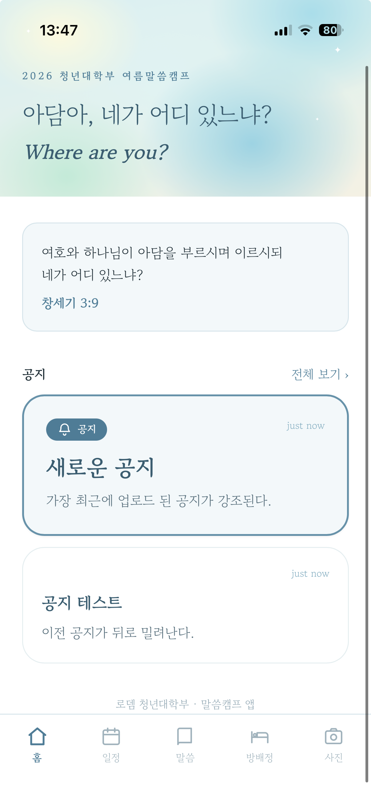
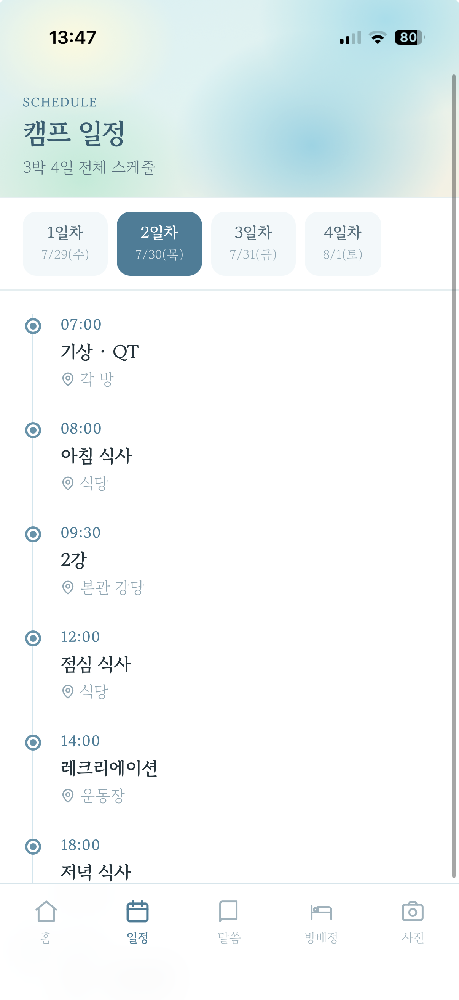
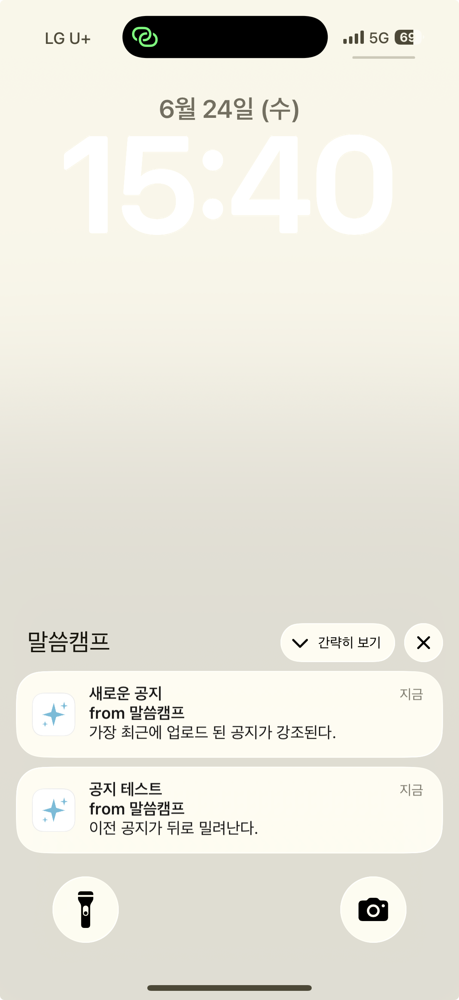

# Convene

> 워크숍·수련회·캠프 같은 여러 날짜의 오프라인 행사를 위한 **설치형 컴패니언 PWA**.
> QR 코드로 설치하고, 운영진 공지를 전 참가자 폰에 **실시간 푸시 알림**으로 전달한다.

🔗 **Live demo (첫 배포 인스턴스 · 로뎀 캠프):** https://rodemcamp.web.app

📐 **디자인 기록:** [DESIGN.md](DESIGN.md)

---

## 프로젝트 소개

Convene은 다중일 오프라인 행사(수련회·워크숍·캠프)에서 참가자에게 필요한 정보를
한 곳에 모아 주는 모바일 웹앱이다. 앱스토어 심사 없이 **QR 스캔만으로 설치**되고,
일정·배정·자료를 오프라인에서도 확인할 수 있으며, 운영진 공지가 **모든 참가자 폰에
푸시 알림**으로 즉시 전달된다.

기획부터 배포까지 직접 진행했으며, 제품은 범용으로 설계하되 각 행사의 브랜딩·일정·
콘텐츠는 인스턴스 설정으로 분리했다. **첫 배포처는 로뎀나무교회 청년부 여름캠프
(80~100명, 3박 4일)** 이며, iOS PWA 푸시 제약·서비스워커 충돌 등 실제 프로덕션
문제를 해결한 것이 핵심이다.

---

## 첨부 사진

| 홈 | 일정 | 공지 푸시 |
|---|---|---|
|  |  |  |

---

## ✨ 주요 기능

- **실시간 공지 푸시** — 관리자가 공지 작성 → 전 사용자 폰에 백그라운드 푸시 알림
- **포그라운드 인앱 토스트** — 앱 사용 중 새 공지가 등록되면 화면 상단에 토스트가 뜨고, 위로 스와이프하거나 탭하여 닫는다
- **푸시 탭 시 앱 이동** — 푸시 알림을 탭하면 앱이 자동으로 열린다
- **앱 아이콘 배지** — iOS에서 읽지 않은 공지 수를 앱 아이콘 배지로 표시한다
- **공지 실시간 반영** — Firestore 구독으로 앱을 열면 홈 상단에 최신 공지 1개가 바로 표시(홈 구성: 공지 최신 1 · 라이브 현재 순서 · 자료실을 한 화면에)
- **라이브 현재 순서 카드** — 일정표를 기준으로 "지금 진행 중"과 다음 순서를 시각에 따라 자동 표시하고, 각 순서에서 관련 말씀·자료실·메뉴·플레이리스트로 바로 이동. 시간이 밀리면 관리자가 변동 안내 메모만 얹는다
- **공지 상세 및 목록** — 홈에서 최신 공지를 보여주고, 상세 페이지와 전체 목록 페이지로 모든 공지를 확인
- **식단표 · 플레이리스트** — 정보 탭에서 일자별 식단표와 캠프 찬양 유튜브 플레이리스트로 이동
- **이미지 / 파일 첨부** — 블록 에디터로 텍스트, 이미지, PDF 파일을 글 중간에 원하는 순서로 배치
- **상세 첨부 표시** — 공지 상세에서 이미지를 원본 비율로 보여주고, 파일은 보기 및 다운로드로 연결
- **제목 길이 제한 표시** — 홈과 목록에서 공지 제목을 20자로 자르고 말줄임으로 표시
- **상대시간 표시** — 공지에 just now, N분 전 형식의 상대시간 표기
- **스플래시 화면** — 앱 진입 시 아이콘에서 로딩 막대를 거쳐 홈으로 이어지는 진입 연출
- **PWA 앱 아이콘** — 홈 화면 설치 시 브랜드 색을 반영한 전용 아이콘 표시
- **QR 설치형 PWA** — 앱스토어 없이 홈 화면에 설치, 네이티브 앱 같은 경험
- **오프라인 대응** — 서비스워커 캐싱으로 캠프장 네트워크가 불안정해도 조회 가능
- **관리자 전용 페이지** — Firebase Auth 로그인 기반 공지 작성/발송
- **안드로이드 뒤로가기 계층 제어** — 자식 화면에서 부모 화면으로, 공지 상세에서 목록으로 이동하고, 홈에서는 앱이 종료되지 않도록 트랩하며, 방배정에서는 검색만 해제한다
- **사진 탭** — 하단 탭에서 Google Photos 공유 앨범 연동
- **캠프 일정 / 방배정 / 말씀 본문** — 일자별 타임라인, 이름과 방 검색, 강의 목록 → 개별 본문 페이지 이동
- **말씀 그룹 구조** — 주제 강의, 개회 폐회, GBS, 새벽 메시지로 묶은 목록에서 강의를 골라 본문 상세로 이동(한/EN 토글)
- **5개 하단 탭** — 홈, 일정, 말씀, 방배정, 사진으로 구성

---

## 아키텍처


- **DB**: Firestore — `announcements`(공지), `tokens`(FCM 토큰)
- **푸시**: Firebase Cloud Messaging (웹 푸시 / VAPID)
- **발송 서버**: Cloud Functions (Firestore `onCreate` 트리거 → 전체 토큰 일괄 발송 + 만료 토큰 자동 정리)
- **인증**: Firebase Auth (관리자 이메일/비밀번호)
- **호스팅**: Firebase Hosting

---

## 기술 스택

| 구분 | 기술 |
|---|---|
| Frontend | React 18, React Router, Vite 5 |
| Styling | Tailwind CSS |
| Font | Gowun Batang, Hahmlet |
| PWA | vite-plugin-pwa (Workbox, injectManifest) |
| Backend | Firebase Firestore, Cloud Functions, Auth |
| Storage | Firebase Storage |
| Push | Firebase Cloud Messaging (FCM) |
| Hosting | Firebase Hosting |

---

## 기술적으로 신경 쓴 점

실제 배포 과정에서 마주친 문제와 해결 방법이다.

### 1. iOS PWA 푸시 알림 제약 대응
iOS는 16.4부터만 웹 푸시를 지원하며, **반드시 "홈 화면에 추가" 후 설치된 앱으로
실행한 상태**에서만 권한 요청과 수신이 가능하다. 이를 고려해 온보딩 흐름과
안내 문구를 설계하고, 권한이 이미 허용된 경우 "알림 받기" 버튼을 숨겨
UI를 단순화했다.

### 2. 서비스워커 충돌 해결 (injectManifest)
`vite-plugin-pwa`의 기본 `generateSW`는 자체 서비스워커를 생성하는데,
FCM 백그라운드 수신용 서비스워커와 루트 스코프에서 충돌한다.
**`injectManifest` 전략으로 전환**해 단일 커스텀 서비스워커(`src/sw.js`)가
오프라인 캐싱(Workbox)과 FCM 백그라운드 수신을 모두 담당하도록 통합했다.

### 3. 푸시 중복 수신 버그 해결
`notification` 페이로드를 보내면 FCM SDK가 알림을 자동 표시하고,
동시에 `onBackgroundMessage` 핸들러가 또 표시해 **알림이 2번** 오는 문제가 있었다.
**`data` 페이로드로 전환**해 서비스워커에서 한 번만 표시하도록 수정했다.

### 4. 비용 최적화
Cloud Functions의 컨테이너 이미지 정리 정책(1일)을 설정해 불필요한
Artifact Registry 스토리지 비용을 방지했고, 일정과 방배정처럼 변동 없는 데이터는
DB 대신 정적 파일로 두어 읽기 비용을 최소화했다.

### 5. iOS PWA 상태바와 설치 특성
iOS는 `theme-color`로 상태바를 단색으로 칠하며, `apple-mobile-web-app-status-bar-style`은
홈 화면 추가 시점에만 읽혀 값을 바꾸면 재설치가 필요하다. 이를 고려해 상태바 처리를
설계했다. Android는 상태바를 OS가 칠하는 단색으로 표시하므로 매니페스트 `theme_color`로 맞춘다.

### 6. 다이어그램 렌더링 안정화
GitHub에서 Mermaid 렌더링이 깨지는 문제가 있어, 아키텍처 다이어그램을 PNG 이미지로
교체해 어디서든 동일하게 보이도록 했다.

### 7. Android WebAPK 설치 경고 대응
안드로이드는 PWA를 WebAPK로 설치하며, WebAPK의 targetSdkVersion이 낮으면 Google Play
프로텍트가 "안전하지 않은 앱" 경고를 표시한다. 이 값은 브라우저와 구글의 WebAPK 생성
서비스가 결정해 앱 코드로 제어할 수 없으므로, 첫날 온보딩 안내에서 "무시하고 설치"를
안내하는 방식으로 대응했다.

### 8. 알림 클릭 동작의 플랫폼 차이
iOS는 푸시를 탭하면 자동으로 앱을 열지만, 안드로이드는 서비스워커의 notificationclick
핸들러가 있어야 동작한다. 핸들러를 추가해 양 플랫폼에서 알림 탭 시 앱이 열리도록 했다.

### 9. 포그라운드와 백그라운드 분리
앱이 백그라운드일 때는 시스템 푸시로, 포그라운드일 때는 Firestore 구독 기반 인앱
토스트로 처리해 사용자 경험을 다듬었다. 앱을 보고 있는 동안 시스템 알림이 뜨지 않는
플랫폼 동작을 인앱 토스트로 보완한다.

### 10. 알림 중복과 덮어쓰기 방지
data 페이로드를 사용해 FCM 자동 표시와 서비스워커 표시가 겹치는 중복을 막고, 알림마다
공지 문서 id를 고유 tag로 부여해 여러 공지가 서로 덮어쓰지 않고 쌓이도록 했다.

### 11. iOS 앱 아이콘 배지
안드로이드는 자동 배지를 지원하지만 iOS는 Badging API로 직접 설정해야 한다. 읽지 않은
공지 수를 IndexedDB에 누적해 setAppBadge로 표시하고, 앱 진입 시 clearAppBadge로
초기화했다.

### 12. 서비스워커 갱신 특성
서비스워커를 변경 배포하면 기존 설치 기기에서 갱신이 지연될 수 있다. 주요 변경은 캠프
전에 완료하고, 필요 시 재설치로 갱신하는 운영 방침을 세웠다.

### 13. 블록 기반 리치 공지
공지를 텍스트, 이미지, 파일 블록의 순서 배열로 저장하고 첨부는 Firebase Storage에
업로드한다. 이미지는 업로드 전에 클라이언트에서 리사이즈해 용량과 로딩 속도를
최적화했다. 첫 텍스트 블록을 body로 저장해 기존 텍스트 전용 공지와의 하위호환을
유지했다.

### 14. 서비스워커 즉시 갱신
skipWaiting, clientsClaim, cleanupOutdatedCaches를 적용해 배포 후 앱 재실행만으로 새
버전이 적용되게 했다. 청크 로드에 실패하면 한 번 자동으로 새로고침해 옛 빌드와 새 빌드의
파일 불일치를 복구한다.

### 15. 긴 문자열 오버플로우 방지
한글 줄바꿈을 위해 word-break keep-all을 사용하므로 띄어쓰기 없는 긴 문자열이 가로로
넘쳐 화면이 밀릴 수 있다. overflow-wrap으로 넘칠 때만 강제 줄바꿈되게 하고, 콘텐츠
영역에 가로 오버플로우를 막아 해결했다.

### 16. 계층적 뒤로가기 제어
안드로이드 뒤로가기를 popstate로 가로채, 도달 경로와 무관하게 지정된 부모 화면으로
이동시킨다. 공지 상세는 항상 목록으로 돌아간다. 홈에서는 더미 history 엔트리를 쌓아
뒤로가기로 앱이 종료되거나 외부로 나가지 않게 막았다. 방배정에서는 검색어가 있을 때
뒤로가기가 홈으로 가지 않고 검색만 해제되도록 처리했다. iOS 홈화면 PWA에는 시스템
뒤로가기가 없어 화면 내 뒤로 버튼으로 대응한다.

---

## 프로젝트 구조

```
camp-app/
├─ src/
│  ├─ pages/         # Home, Schedule, Rooms, Verses, VerseDetail, Info,
│  │                 #   Menu, Playlist, Admin, Announcements, AnnouncementDetail
│  ├─ components/    # BottomNav, PageHeader, SplashScreen, Toast
│  ├─ data/          # 일정, 방배정, 말씀, 식단 (정적 데이터)
│  ├─ lib/push.js    # 알림 권한 요청 + FCM 토큰 등록
│  ├─ lib/time.js    # 상대시간 포맷 (just now, N분 전)
│  ├─ lib/badge.js   # 읽지 않은 공지 배지 카운트 (IndexedDB)
│  ├─ lib/upload.js  # 이미지 리사이즈 + Storage 업로드
│  ├─ lib/blocks.js  # 공지 블록 미리보기 헬퍼
│  ├─ hooks/useBackNavigation.js  # 안드로이드 뒤로가기 계층 제어
│  ├─ firebase.js    # Firebase 초기화
│  └─ sw.js          # 서비스워커 (캐싱 + FCM 백그라운드 + 알림 클릭)
├─ functions/        # Cloud Function (공지 푸시 발송)
├─ firestore.rules   # Firestore 보안 규칙
├─ storage.rules     # Storage 보안 규칙
└─ vite.config.js    # PWA 설정 (injectManifest)
```

---

## 로컬 실행

```bash
npm install
cp .env.local.example .env.local   # Firebase 설정값 입력
npm run dev
```

### 배포

```bash
npm run build
npx firebase-tools deploy --only hosting
```

---

## 향후 계획

- [ ] 일정,방배정을 Firestore로 옮겨 관리자 페이지에서 실시간 편집
- [ ] 포그라운드 알림 인앱 토스트 표시
- [ ] GitHub Actions 기반 CI/CD 자동 배포
- [ ] 홈 위젯 추가
