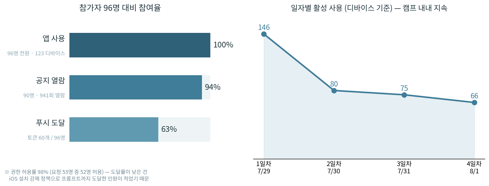

# Convene

**다중일 오프라인 행사(워크숍·수련회·캠프)용 설치형 컴패니언 PWA**

QR 코드로 설치하고, 운영진 공지를 전 참가자 폰에 실시간 푸시로 전달한다.
행사별 정체성은 설정 파일 하나로 분리해 다음 행사에 그대로 재사용한다.

<p>
  
  
  
  
  
</p>

🔗 **Live:** https://rodemcamp.web.app

| | |
|---|---|
| **역할** | 기획 · 제품 디자인 · 개발 · 운영 · 측정 — **단독 수행** |
| **첫 배포** | 로뎀나무교회 청년대학부 여름말씀캠프 (2026.7.29–8.1, 3박 4일) |
| **규모** | 참가자 96명 전원 사용 · 공지 941회 열람 · 4일간 세션 1,616회 |
| **문서** | [의사결정 기록](CASE_STUDY.md) · [디자인 기록](DESIGN.md) · [푸시 구현 가이드](docs/FIREBASE_PUSH_GUIDE.md) |

---

## 1. 문제

80~100명이 3박 4일을 함께 보내는 오프라인 캠프에서, 정보 전달이 세 갈래로 새고 있었다.

- **공지가 묻힌다** — 단체 카톡방에서 공지가 잡담에 밀려 내려가고, 정작 필요한 순간에 못 찾는다.
- **정보가 흩어진다** — 일정은 인쇄물, 방배정은 엑셀 캡처, 말씀 본문은 또 다른 파일. 참가자가 매번 다른 곳을 뒤진다.
- **변경이 반영되지 않는다** — 집회가 길어지고 식사가 당겨져 순서가 수시로 밀리는데, 인쇄물은 이미 손을 떠났다.

**문제 정의:** 오프라인 행사의 흩어진 정보와 실시간 변경을, 참가자가 **한 곳에서 · 알림으로 · 네트워크가 끊겨도** 받게 한다.

기존 대안은 각각 하나씩을 놓쳤다. 카톡은 정보 통합을, 인쇄물은 실시간성을, 네이티브 앱은 100명에게 설치를 강요하는 마찰(심사·용량·업데이트)을 감당하지 못했다. **설치형 PWA**를 택한 이유다.

---

## 2. 해결

QR 스캔 한 번으로 홈 화면에 설치되고, 앱스토어 심사 없이 웹 배포로 갱신되며, 캠프장 네트워크가 불안정해도 열린다. 운영진이 공지를 쓰면 전 참가자 폰에 백그라운드 푸시가 즉시 도달한다. 일정·방배정·말씀·식단·조 편성이 한 앱에 모여 있고, 자주 바뀌는 정보는 **관리자가 폰에서 고치면 재배포 없이 전원에게 반영**된다.

---

## 3. 성과 — 목표 대비 실제

캠프 **전에** 성공 지표를 먼저 정의하고, 캠프 **후에** 직접 만든 관리자 통계 대시보드로 검증했다.



| 갈래 | 지표 | 목표(사전 정의) | 실제 | |
|---|---|---|---|---|
| 확보 | 앱 사용률 (사용자 / 참가자) | ≥ 90% | **100%** (96/96) | ✅ |
| 참여 | 공지 열람률 | 정성적 "빠뜨리는 사람 없음" | **94%** (90/96) · 누적 941회 | ✅ |
| 알림 | 푸시 권한 허용률 | ≥ 70% | **98%** (52/53) | ✅ |
| 알림 | 푸시 도달률 (토큰 보유 / 참가자) | — | **63%** (60/96) | ⚠️ |
| 참여 | 4일 리텐션 | 3일 이상 방문 ≥ 60% | 부분 측정 — 일자별 활성 디바이스 146 → 80 → 75 → 66 | ◐ |
| 활성화 | 온보딩(이름·목장) 완료율 | ≥ 90% | 미측정 | — |
| 활성화 | 조 편성 완료율 | ≥ 80% | 미측정 | — |

**사용 깊이** 4일간 세션 1,616회 · 세션당 평균 5.1화면 · 등록 디바이스 123개(재설치·다중 기기 포함)
**플랫폼** iOS 58% / Android 42%

### 발견: 병목은 발송 로직이 아니라 설치 단계였다

푸시 **허용률 98%**와 **도달률 63%** 사이의 35%p 격차가 데이터에서 드러났다. 원인은 거부가 아니었다. iOS는 홈 화면에 설치한 상태에서만 푸시 권한을 요청할 수 있어, **애초에 권한 프롬프트까지 도달한 사람이 96명 중 53명**이었다. 프롬프트를 본 사람은 98%가 허용했고, 알림을 못 받은 사람 대부분은 앱을 설치하지 않은 사람이었다.

지표를 나누지 않았다면 "푸시 성능이 나쁘다"고 오진하고 발송 로직을 손댔을 것이다. 실제 개선 과제는 **설치 유도 온보딩**이다.

> 측정하지 못한 지표는 채우지 않고 그대로 뒀다. 이벤트 로깅 설계 단계에서 온보딩·조 편성 완료 이벤트의 분모를 확정하지 않은 것이 원인이며, 다음 인스턴스의 선결 과제다.

---

## 4. 핵심 제품 결정

전체 6개 결정의 "문제 → 선택지 → 결정 → 근거"는 **[CASE_STUDY.md](CASE_STUDY.md)** 에 정리했다. 여기서는 셋만 요약한다.

**① 라이브 "현재 순서" — 자동 vs 수동, 세 번 되돌아온 결정**
기기 시계 기반 자동 계산으로 시작했으나 순서가 10~40분씩 밀려 "지금"을 자주 틀렸다. 관리자 수동 포인터로 바꿨더니 매 순서 넘기는 마찰과 누락이 컸다. 최종은 **자동 계산 + 관리자 변동 메모** 절충 — 큰 흐름은 자동으로 맞추고, 예외만 사람이 한 줄("점심 30분 지연")로 덧댄다. 자동의 무마찰과 수동의 정확성을 나눠 가졌다.

**② 데이터 위치 — 정적 우선, 그러나 명시된 예외**
불변·읽기비용 데이터(일정·말씀)는 정적 파일에, 가변·실시간 데이터(공지·프로필·라이브 메모)는 Firestore에 뒀다. **방배정만 예외로 Firestore로 이전** — iOS PWA는 코드 배포 반영이 늦어 캠프 중 재설치를 요구하는데, 방배정은 자주 바뀐다. "관리자가 폰에서 저장 → 전원 즉시 반영, 무배포"의 값어치가 미미한 읽기비용보다 훨씬 컸다. 원칙을 세우되, 근거가 뒤집히는 지점을 예외로 기록했다.

**③ 스코프 컷 — 뺀 것에도 근거를 남긴다**
공지 댓글은 운영 부담과 부정적 상호작용 위험으로 제거했다. 참여자 "팔로우"는 관계 그래프 없이 인원수 연출만 남겨 "모두가 동역자" 메시지를 최소 복잡도로 냈다. 3박 4일짜리 행사에 커뮤니티 기능을 붙이는 것은 수명 대비 과투자라고 판단했다.

---

## 5. 재사용 설계

행사마다 달라지는 값(앱 이름·표어·브랜드 색·외부 링크·시작일)을 **`src/config/instance.js` 한 파일**에 모았다. Tailwind 설정과 PWA 매니페스트가 이 파일을 함께 참조하므로, 새 행사에 배포하려면 이 파일만 교체하면 앱 전체의 이름·아이콘·테마 색·표어가 일괄 전환된다.

```js
export const INSTANCE = {
  appName: "2026 여름말씀캠프",
  org: "2026 로뎀나무교회 청년대학부 여름말씀캠프",
  slogan: "아담아, 네가 어디 있느냐?",
  liveAnchor: "2026-07-01",          // 라이브 '현재 순서' 계산 기준일
  theme: { palette: { /* ... */ }, manifestThemeColor: "#D3F0F3" },
};
```

---

## 6. 주요 기능

**참가자**

- **QR 설치형 PWA** — 앱스토어 없이 홈 화면 설치, 오프라인 캐싱으로 네트워크 불안정 환경에서도 열람
- **실시간 공지 푸시** — 관리자 작성 즉시 전원에게 백그라운드 알림. 앱 사용 중일 땐 시스템 알림 대신 인앱 토스트
- **라이브 "현재 순서"** — 지금·다음 순서를 자동 표시하고 관련 자료(말씀·식단·플레이리스트)로 바로 이동
- **말씀 본문** — 강의별 본문, 한글(개역개정)↔영어(NIV) 토글, 본문 글씨 크기 조절
- **일정 · 방배정 · 식단표 · 플레이리스트 · 사진**(Google Photos 공유 앨범 연동)
- **조 편성 게임** — 취향 질문 4개로 레크레이션 팀 배정, 서버 로직 없이 결정
- **참여자 디렉토리 · 목장** — 프로필 기반 참여자 목록
- **마이페이지** — 닉네임·목장·프로필 사진(크롭 지원) 관리
- **데스크톱 레이아웃** — 태블릿·노트북용 별도 셸(현장 안내 화면 대응)

**운영진**

- **리치 공지 에디터** — 텍스트·이미지·PDF·링크 블록을 순서대로 배치, 상단 상시 노출 **고정 공지(자료 허브)**
- **관리자 콘솔** — 공지 CRUD, 참여자 관리, 방배정 편집, 조 편성 관리, **운영 통계 대시보드**
- **무배포 실시간 편집** — 방배정·조 편성·라이브 메모를 폰에서 수정, 재배포 없이 전원 반영
- **권한 위임** — 임원 계정 추가로 여러 운영진이 콘솔 공유

**측정**

- 자체 이벤트 로그(`events` 컬렉션) + Google Analytics 4 병행. 설치·열람·공지 열람·라이브 링크 클릭·푸시 권한을 플랫폼·세션·일자와 함께 기록하고 관리자 대시보드로 집계

---

## 7. 아키텍처


| 계층 | 구성 |
|---|---|
| DB | Firestore — 공지, 푸시 토큰, 사용자, 방배정, 이벤트 로그 |
| 푸시 | Firebase Cloud Messaging (웹 푸시, VAPID) |
| 발송 | Cloud Functions — Firestore `onCreate` 트리거로 전체 토큰 일괄 발송, 만료 토큰 자동 정리 |
| 인증 | Firebase Auth — 관리자 이메일 로그인 / 참가자 익명 로그인 |
| 파일 | Firebase Storage — 공지 이미지·PDF, 프로필 사진 |
| 분석 | Firestore `events` + Google Analytics 4 |
| 호스팅 | Firebase Hosting |

### 기술 스택

| 구분 | 기술 |
|---|---|
| Frontend | React 18, React Router 6, Vite 5 |
| Styling | Tailwind CSS 3, Gowun Batang, Hahmlet |
| PWA | vite-plugin-pwa (Workbox, injectManifest 전략) |
| Backend | Firebase Firestore · Cloud Functions · Auth · Storage |
| Push | Firebase Cloud Messaging |
| Hosting | Firebase Hosting |

---

## 8. 기술적으로 해결한 문제

실제 배포·운영에서 마주친 문제와 해결 방법이다.

### 플랫폼별 알림 동작 차이

- **iOS PWA 푸시 제약** — iOS는 16.4부터만 웹 푸시를 지원하고, 홈 화면에 설치한 앱으로 실행한 상태에서만 권한 요청·수신이 가능하다. 온보딩과 안내 문구를 이 제약에 맞춰 설계했다.
- **알림 클릭 이동** — iOS는 푸시를 탭하면 앱이 자동으로 열리지만 Android는 서비스워커의 `notificationclick` 핸들러가 있어야 동작한다. 핸들러를 추가해 양 플랫폼 동작을 통일했다.
- **iOS 앱 아이콘 배지** — Android는 자동 배지를 지원하지만 iOS는 Badging API로 직접 설정해야 해, 읽지 않은 공지 수를 `setAppBadge`로 표시하고 앱 진입 시 초기화했다.

### 서비스워커와 푸시 안정화

- **서비스워커 충돌** — vite-plugin-pwa의 기본 서비스워커와 FCM 서비스워커가 루트 스코프에서 충돌하는 문제를, `injectManifest` 전략으로 단일 서비스워커에 통합해 해결했다.
- **알림 중복·덮어쓰기 방지** — `data` 페이로드로 전환해 중복 표시를 막고, 알림마다 고유 `tag`를 부여해 여러 공지가 서로 덮어쓰지 않고 쌓이게 했다.
- **전달 우선순위** — webpush `Urgency: high` 헤더로 절전 상태에서도 즉시 전달되도록 했다.
- **즉시 갱신** — `skipWaiting` · `clientsClaim` · `cleanupOutdatedCaches`로 배포 후 앱 재실행만으로 새 버전이 적용되게 하고, 청크 로드 실패 시 자동 복구를 넣었다.
- **포그라운드/백그라운드 분리** — 백그라운드는 시스템 푸시, 포그라운드는 Firestore 구독 기반 인앱 토스트로 처리했다.

### 보안 — 익명 로그인 구조의 결함 발견

전원이 익명 로그인을 쓰는 구조 탓에 "로그인 여부"만으로는 관리자를 가릴 수 없어, **익명 사용자에게 관리자 화면이 노출되는 결함**이 있었다. UI 게이트를 이메일 보유 기준으로 바꾸고 Firestore 규칙에서 쓰기를 이메일 관리자로 제한해 **화면과 데이터 양쪽**을 막았다.

### 사용자 경험

- **계층적 뒤로가기** — Android 뒤로가기를 `popstate`로 가로채 도달 경로와 무관하게 지정된 부모 화면으로 보내고, 홈에서는 히스토리 누적을 제거해 종료 동작을 일관되게 만들었다.
- **Android WebAPK 설치 경고** — WebAPK의 `targetSdkVersion`이 낮으면 Play 프로텍트가 경고를 표시한다. 앱 코드로 제어할 수 없는 값이라 온보딩 안내로 대응했다.
- **긴 문자열 오버플로우** — 한글 줄바꿈용 `word-break: keep-all` 환경에서 띄어쓰기 없는 긴 문자열이 화면을 밀어내는 문제를 `overflow-wrap`으로 해결했다.
- **다이어그램 렌더링** — GitHub에서 Mermaid 렌더링이 불안정해 아키텍처 다이어그램을 PNG로 교체했다.

---

## 9. 스크린샷

| 홈 | 일정 | 공지 푸시 |
|---|---|---|
|  |  |  |

---

## 10. 회고

- **"동작한다"는 한 기기의 착각이다.** 상태바·설치·배지·알림 클릭·WebAPK 경고 등 브라우저와 OS별 동작 차이가 커서, 실기기(iOS·Android) 검증 없이는 아무것도 확신할 수 없었다.
- **지표는 정의가 절반이다.** 같은 데이터도 분모를 잘못 잡으면 성과가 하락처럼 보인다. 허용률과 도달률을 분리하고 목표 대상을 분모로 잡았을 때 비로소 진짜 병목이 보였다.
- **병목은 기술이 아니라 온보딩일 수 있다.** 푸시 도달률의 한계는 발송 로직이 아니라 설치 완료율에 있었다.
- **트레이드오프를 문서로 남기니 결정이 빨라졌다.** 라이브 카드처럼 세 번 되돌아온 결정도, 근거가 적혀 있으면 재논의 비용이 낮다.
- **측정 설계는 기능 개발과 같은 시점에 해야 한다.** 온보딩·조 편성 완료율을 못 채운 이유는 데이터가 없어서가 아니라, 분모를 정하지 않은 채 이벤트를 심었기 때문이다.

---

## 11. 프로젝트 구조

```
convene-pwa/
├─ src/
│  ├─ config/instance.js   # 행사별 정체성(이름·표어·브랜드 색·링크) — 재배포 시 이 파일만 교체
│  ├─ pages/               # Home, Schedule, Verses, VerseDetail, Rooms, Info, Mokjang,
│  │                       # Menu, Playlist, TeamGame, Participants, Welcome,
│  │                       # Announcements, AnnouncementDetail,
│  │                       # Admin(+ AdminPeople / AdminRooms / AdminTeams / AdminStats)
│  ├─ components/          # BottomNav, PageHeader, Toast, SplashScreen, VerseRefs, ...
│  │  └─ desktop/          # 태블릿·노트북 전용 레이아웃
│  ├─ hooks/               # useAuth, useBackControl, useHomeData, useRooms, useIsDesktop, ...
│  ├─ data/                # 일정·말씀(한글·NIV)·방배정·식단·목장 정적 데이터
│  ├─ lib/                 # push, badge, track(이벤트 로깅), liveSchedule, blocks, upload, ...
│  ├─ firebase.js          # Firebase 초기화 (Firestore, Auth, Messaging, Storage, Analytics)
│  └─ sw.js                # 서비스워커 (캐싱 + FCM 백그라운드 + 배지)
├─ functions/              # Cloud Function (공지 푸시 발송, 만료 토큰 정리)
├─ docs/                   # 아키텍처·지표 이미지, 푸시 구현 가이드
├─ firestore.rules         # Firestore 보안 규칙
├─ storage.rules           # Storage 보안 규칙
└─ vite.config.js          # PWA 설정 (injectManifest)
```

---

## 12. 로컬 실행

```bash
npm install
cp .env.local.example .env.local   # Firebase 설정값 입력
npm run dev
```

### 배포

```bash
npm run build
npx firebase-tools deploy --only hosting
```

푸시 발송 함수와 보안 규칙 구현은 [docs/FIREBASE_PUSH_GUIDE.md](docs/FIREBASE_PUSH_GUIDE.md)에 정리했다.

---

## 13. 다음 개선

- **설치 유도 온보딩 강화** — 푸시 도달률 63%의 병목인 iOS 설치 단계를 개선한다. (최우선)
- **측정 설계 선행** — 온보딩·조 편성 완료율의 분모를 이벤트 설계 단계에서 확정한다.
- 일정·식단 등 나머지 정적 데이터도 관리자 페이지에서 실시간 편집하도록 확장한다.
- GitHub Actions 기반 CI/CD 자동 배포를 구성한다.

---

## 만든 사람

**이윤종** — 기획 · 디자인 · 개발 · 운영 단독 수행 · 2026

MIT License
