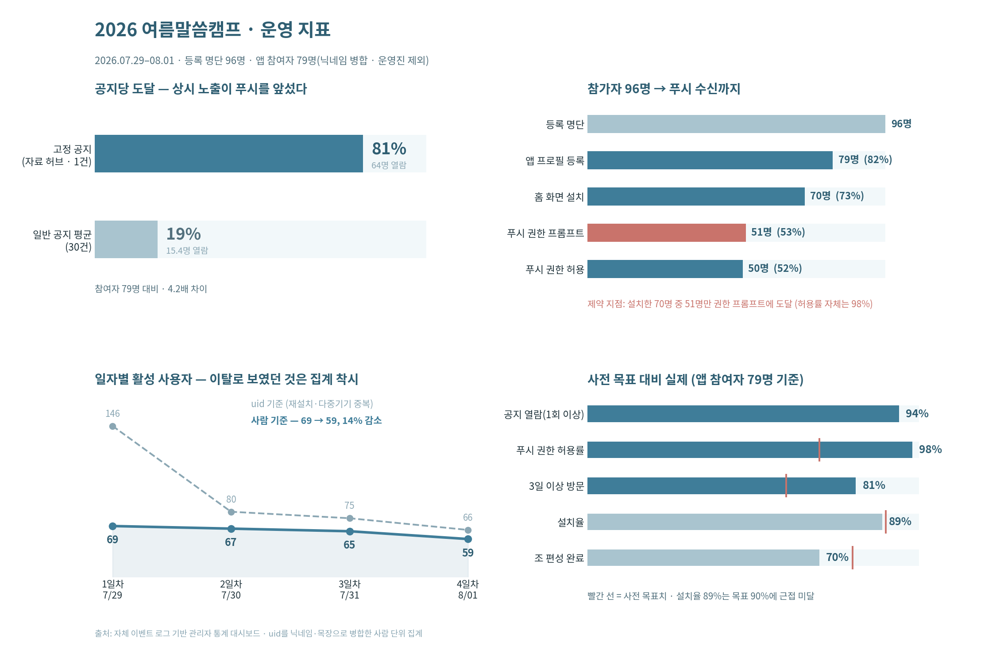
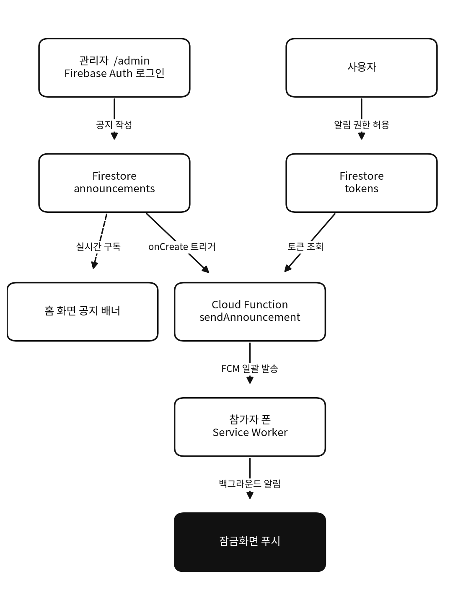
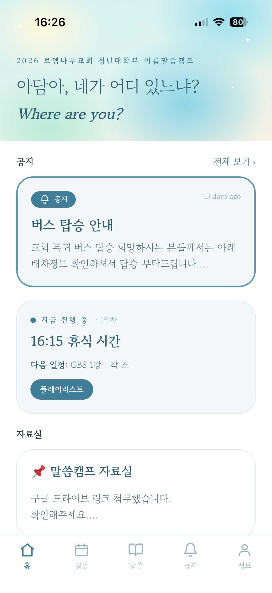
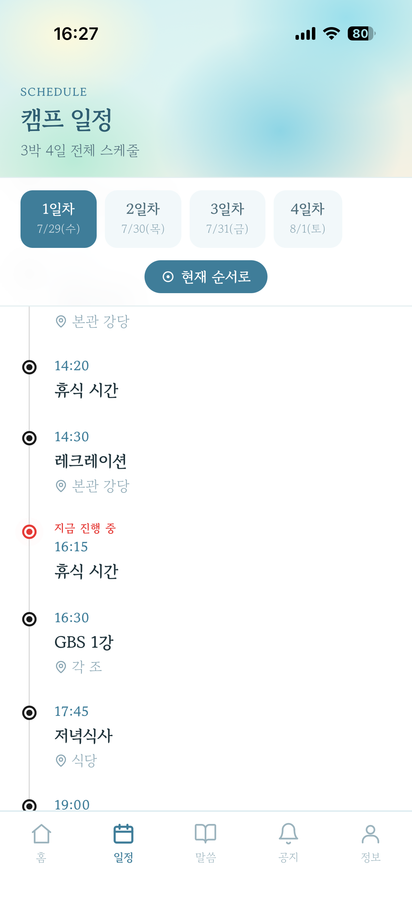
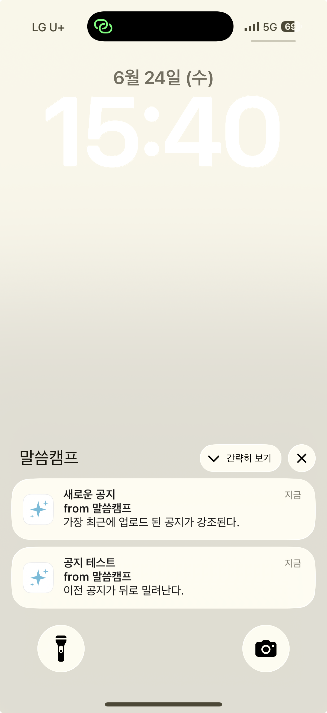
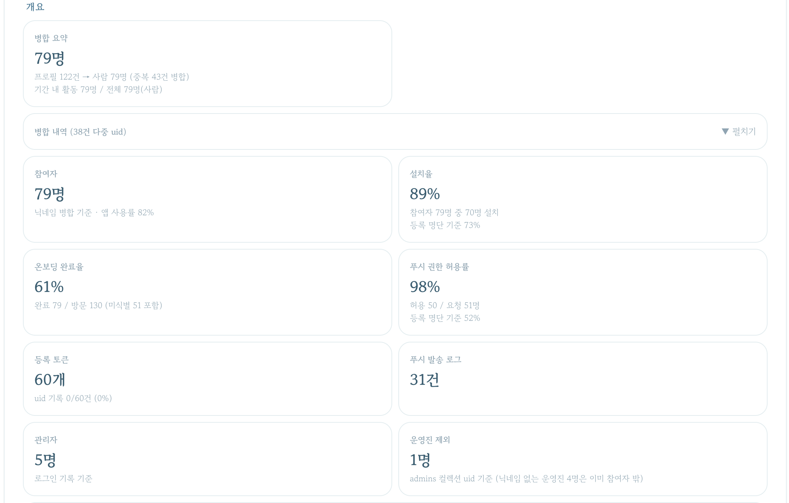
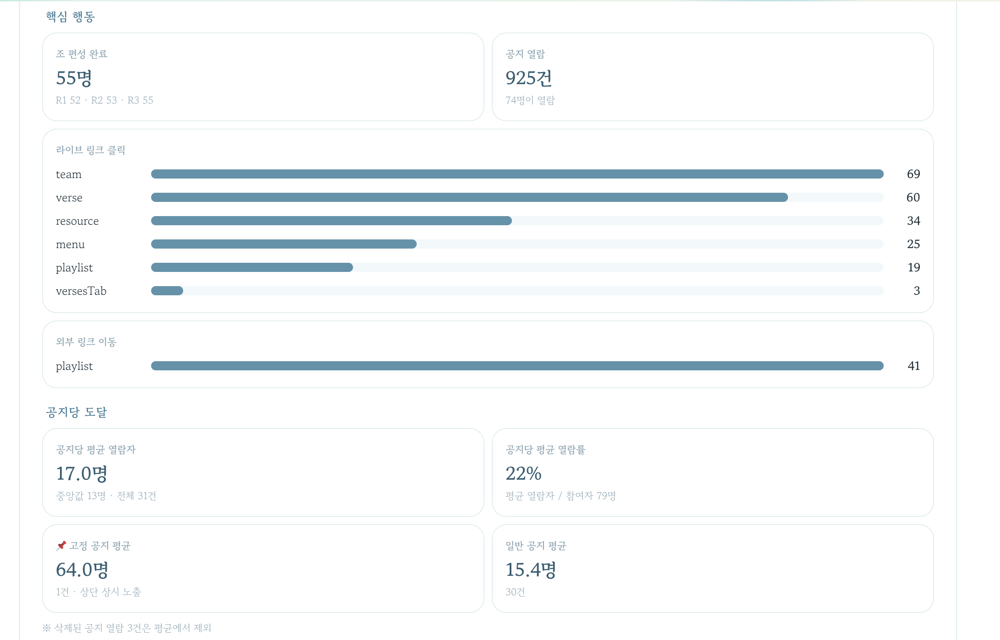

# Convene

**다중일 오프라인 행사(워크숍·수련회·캠프)용 설치형 컴패니언 PWA**

QR 코드로 설치하고, 운영진 공지를 전 참가자 단말에 실시간 푸시로 전달한다.
행사별 설정은 단일 설정 파일로 분리해 다음 행사에 재사용할 수 있도록 구성했다.

<p>
  
  
  
  
  
</p>

🔗 **Live:** https://rodemcamp.web.app

| | |
|---|---|
| **역할** | 기획 · 제품 디자인 · 개발 · 운영 · 측정 — **단독 수행** |
| **첫 배포** | 로뎀나무교회 청년대학부 여름말씀캠프 (2026.7.29–8.1, 3박 4일, 참가자 96명) |
| **성과 요약** | 앱 참여자 79명 · 설치율 89% · 3일 이상 방문 81% · 공지당 도달 22%(고정 81% / 일반 19%) |
| **사용자 조사** | 응답 46명(48%) · 앱 선호 88% · 재사용 의향 100% |
| **문서** | [의사결정 기록](CASE_STUDY.md) · [디자인 기록](DESIGN.md) · [새 행사 배포 가이드](docs/SETUP_GUIDE.md) · [푸시 구현 가이드](docs/FIREBASE_PUSH_GUIDE.md) |

---

## 1. 문제

이 문제 정의는 이전 캠프를 직접 운영하며 반복적으로 관찰한 내용과, 임원진 회의 및 참가자·운영진과의 대화에서 매년 제기된 사항을 근거로 한다. 정보 전달의 문제는 세 가지로 정리된다.

**① 공지가 묻힌다**
단체 카톡방은 알림을 꺼둔 참가자가 많아 공지의 도달 자체가 보장되지 않는다. 확인한 경우에도 이후 대화에 밀려 내려가 필요한 시점에 다시 찾기 어렵다. 이로 인해 운영진은 동일한 공지를 반복해서 게시하게 된다.

**② 정보가 흩어진다**
일정은 인쇄물, 방배정은 엑셀 캡처 이미지, 말씀 본문은 별도 파일, 변경 사항은 메신저로 전달된다. 매체가 네 갈래로 나뉘어 있어 참가자가 정보를 확인할 때마다 다른 경로를 거쳐야 한다.

**③ 변경이 반영되지 않는다**
집회가 길어지면 일정이 지연되고, 식사 시간이 조정되면 앞당겨진다. 그러나 이러한 변경이 실시간으로 전달되지 않으며, 전달되더라도 이미 배포된 원래 일정표와 대조할 수단이 없다.

> **문제 정의** — 오프라인 행사의 분산된 정보와 실시간 변경 사항을, 참가자가 **단일 경로에서 · 알림을 통해** 확인할 수 있게 한다.

---

## 2. 왜 설치형 PWA였나

문제 해결에는 실시간 전달과 정보 통합이 동시에 필요했고, 100명 규모에 적용하려면 설치 마찰이 낮아야 했다. 기존 대안은 각각 하나 이상의 조건을 충족하지 못한다.

| | 실시간 전달 | 정보 통합 | 설치 마찰 |
|---|---|---|---|
| 단체 카톡 | △ 알림 차단 시 미도달 | ✕ 스트림에 묻힘 | ○ 이미 사용 중 |
| 네이버 밴드 | △ 알림 확인율 낮음 | △ 게시판 수준 | △ 가입 필요 |
| 인쇄물 | ✕ | △ 일부만 | ○ |
| 네이티브 앱 | ○ | ○ | ✕ 심사·용량·업데이트 |
| **설치형 PWA** | ○ | ○ | **△ QR 스캔 후 설치 단계** |

PWA 역시 완전한 해법은 아니다. **설치 마찰이 △로 남았고, 이 항목이 실제 운영에서 푸시 도달률의 제약으로 작용했다**(4장 참고). 다만 실시간 전달과 정보 통합을 동시에 충족하면서 100명 규모에 적용하기에는 가장 적합한 선택지로 판단했다.

---

## 3. 해결 방안과 검증

세 문제 각각에 대한 해결 방안과, 해당 방안의 작동 여부를 확인할 지표를 사전에 정의했다.

| 문제 | 해결 방안 | 검증 결과 |
|---|---|---|
| ① 공지가 묻힌다 | 공지 전용 채널 + 작성 즉시 전원 푸시 + 상단 상시 노출 **고정 공지(자료 허브)** + 앱 사용 중 인앱 토스트 | **부분 성공.** 고정 공지는 참여자의 **81%**(64명)에 도달했으나 일반 공지는 평균 **19%**(15.4명)에 그쳤다 |
| ② 정보가 흩어진다 | 일정·방배정·말씀(한/영)·식단·플레이리스트·사진을 단일 앱에 통합, 하단 탭으로 일관된 접근 경로 제공 | **4일간 화면 조회 8,089회 · 앱 오픈당 평균 5.3화면** — 한 번 열면 복수 정보를 연속 조회 |
| ③ 변경이 반영되지 않는다 | 라이브 "현재 순서" 시각 자동 계산 + 관리자 변동 메모 + 방배정·조 편성의 **무배포** 실시간 수정 | **라이브 링크 클릭 210회** (team 69 · verse 60 최다) · **관리자 5명**이 캠프 기간 중 운영 |

세부 기능은 [6장](#6-주요-기능), 결정 근거는 [CASE_STUDY.md](CASE_STUDY.md)에 정리했다.

---

## 4. 성과

캠프 시작 전에 성공 지표를 정의하고, 종료 후 직접 구축한 관리자 통계 대시보드로 측정했다. 로그로는 알 수 없는 이유를 확인하기 위해 사후 설문을 병행했다.



### 목표 대비 실제

분모를 두 가지로 병기했다. **앱 참여자 79명**은 프로필을 등록하고 캠프 기간 중 활동한 고유 인원, **등록 명단 96명**은 참가자 전체다.

| 지표 | 목표(사전) | 앱 참여자 79명 기준 | 등록 명단 96명 기준 | 판정 |
|---|---|---|---|---|
| 공지 열람 (1회 이상) | 정성 목표 "미확인자 없음" | **94%** (74/79) · 925회 | 77% (74/96) | ✅ 달성 |
| 푸시 권한 허용률 | ≥ 70% | **98%** (50/51) | 52% (50/96) | ✅ 달성 |
| 4일 리텐션 (3일 이상 방문) | ≥ 60% | **81%** (64/79) | 67% (64/96) | ✅ 달성 |
| 설치율 | ≥ 90% | **89%** (70/79) | 73% (70/96) | ⚠️ 근접 미달 |
| 온보딩 완료율 | ≥ 90% | — | **82%** (79/96) | ❌ 미달 |
| 레크레이션 참가율 | ≥ 80% | **92–100%** (55 / 1일차 실제 참석자 약 55–60명†) | — | ✅ 달성 |
| **공지당 도달률** | 사후 정의 | **22%** — 고정 81% / 일반 19% | — | 아래 참고 |

† 레크레이션은 1일차에 진행됐으나 다수가 2일차 이후 합류해 등록 명단·앱 참여자 전체가 대상이 아니었다. 1일차 실제 참석자는 로그로 남기지 않아 운영진 기억 기준 55–60명으로 추정한다.

**보조 지표** 앱 오픈 1,529회 · 화면 조회 8,089회 · 공지 발송 31건 · 관리자 5명 · iOS 41 / Android 37 / 기타 1

지표 정의와 분모 선택 근거, 두 지표(온보딩·레크레이션 참가)의 단서는 [CASE_STUDY 8장](CASE_STUDY.md#8-결과--가설-검증)에 정리했다.

### 세 가지 발견

**① 공지는 앱으로 옮긴 것만으로 해결되지 않았다**

이 앱이 풀려던 첫 번째 문제에 대한 답은 **부분 성공**이다. 상단에 상시 노출한 고정 공지는 참여자의 **81%**(64명)에 도달했으나, 푸시로 발송한 개별 공지는 평균 **19%**(15.4명)에 그쳤다. **4.2배 차이다.** 도달을 만든 것은 푸시가 아니라 상시 노출이었다.

"94%가 공지를 열람했다"는 수치는 4일간 아무 공지나 한 번이라도 연 사람의 비율이며, 개별 공지의 도달과는 다르다. 두 지표를 구분하지 않으면 성과를 과대평가하게 된다.

**② 푸시의 병목은 발송 로직이 아니라 설치 단계였다**

권한 **허용률은 98%**였으나 실제로 푸시를 받을 수 있는 사람은 참여자의 **63%**였다. iOS는 홈 화면에 설치한 상태에서만 권한을 요청할 수 있어, 설치한 70명 중 51명만 프롬프트 단계까지 도달했다.

```
등록 명단 96명 → 프로필 등록 79명(82%) → 설치 70명(89%)
              → 권한 프롬프트 51명 ← 제약 지점 → 허용 50명(98%)
```

허용률과 도달률을 별개 지표로 정의했기 때문에 원인을 식별할 수 있었다. 하나의 "푸시 성공률"로 뭉갰다면 63%만 보고 발송 로직을 고쳤을 것이다.

**③ 이탈로 보였던 것은 집계 착시였다**

익명 로그인 구조에서 재설치·기기 추가마다 새 uid가 생성돼, 최초 집계는 uid를 사람으로 간주하고 있었다. 설치율 61%, 1일차 이후 이탈 55%로 나왔으나 **둘 다 실제 현상이 아니라 집계 방식이 만든 수치**였다.

| 지표 | uid 기준(최초) | 사람 기준(재산출) |
|---|---|---|
| 참여자 | 123 | **79** |
| 설치율 | 61% | **89%** |
| 4일 리텐션 | 39% | **81%** |
| 1일차 DAU | 146 | **69** |

닉네임·목장으로 uid를 병합하고 운영진과 기간 외 활동을 분리해 재산출했다. 원본 데이터는 동일하며 집계 방식만 바꿨다. 이 과정과 남은 한계는 [CASE_STUDY 8장](CASE_STUDY.md#8-결과--가설-검증)에 있다.

### 사용자 조사

로그는 무엇이 일어났는지 알려주지만 왜 그런지는 알려주지 않는다. 캠프 종료 8일 후 익명 설문을 실시했다. **응답 46명 / 등록 명단 96명(48%).** 로그상 미사용자는 18%인데 응답자 중에서는 11%로, **앱을 쓰지 않은 사람이 설문에도 덜 응답했다.**

| | |
|---|---|
| 앱이 카톡보다 편했다 | **88%** |
| 다음 캠프에도 사용하겠다 | **100%** |
| 알림을 받았지만 **제목만 보고 넘겼다** | **41%** |

세 번째 수치가 발견 ①의 원인을 설명한다. **공지당 도달 19%는 미수신이 아니라 미개봉의 결과였다.** 푸시는 도달했고 제목까지 읽혔으나 본문을 열 필요를 느끼지 못했다.

> "알림을 위주로 봤는데 알림은 배너로 뜨니까 막상 어플로 들어가는 횟수가 줄어듦"

제목만으로 정보가 전달됐다면 앱을 열지 않는 것이 합리적인 행동이다. 개선 방향도 "더 열게 만들기"가 아니라 **"제목만으로 정보가 완결되게 쓰기"** 로 바뀌었다.

알림 미수신자는 **전원 미설치자**였고(설치 34명 중 0명, 브라우저 사용 7명 중 4명), 카톡이 편했다고 답한 2명도 모두 알림 미수신자였다. 설문 전문과 인용은 [CASE_STUDY 8장](CASE_STUDY.md#8-결과--가설-검증)에 있다.

---

## 5. 재사용 설계

행사마다 달라지는 값(앱 이름·표어·브랜드 색·외부 링크·시작일)을 **`src/config/instance.js` 단일 파일**에 모았다. Tailwind 설정과 PWA 매니페스트가 이 파일을 참조하므로, 새 행사에 배포할 때 이 파일만 교체하면 앱 전체의 이름·아이콘·테마 색·표어가 일괄 전환된다.

```js
export const INSTANCE = {
  appName: "2026 여름말씀캠프",
  org: "2026 로뎀나무교회 청년대학부 여름말씀캠프",
  slogan: "아담아, 네가 어디 있느냐?",
  liveAnchor: "2026-07-01",          // 라이브 '현재 순서' 계산 기준일
  theme: { palette: { /* ... */ }, manifestThemeColor: "#D3F0F3" },
};
```

---

## 6. 주요 기능

**참가자**

- **QR 설치형 PWA** — 앱스토어 심사 없이 홈 화면 설치, 웹 배포만으로 즉시 갱신
- **실시간 공지 푸시** — 관리자 작성 즉시 전원에게 백그라운드 알림. 앱 사용 중에는 시스템 알림 대신 인앱 토스트
- **라이브 "현재 순서"** — 현재·다음 순서를 자동 표시하고 관련 자료(말씀·식단·플레이리스트)로 이동
- **말씀 본문** — 강의별 본문, 한글(개역개정)↔영어(NIV) 토글, 본문 글씨 크기 조절
- **일정 · 방배정 · 식단표 · 플레이리스트 · 사진**(Google Photos 공유 앨범 연동)
- **조 편성 게임** — 취향 질문 4개로 레크레이션 팀 배정, 서버 로직 없이 클라이언트에서 결정
- **참여자 디렉토리 · 목장** — 프로필 기반 참여자 목록
- **마이페이지** — 닉네임·목장·프로필 사진(크롭 지원) 관리
- **데스크톱 레이아웃** — 태블릿·노트북용 별도 셸(현장 안내 화면 대응)

**운영진**

- **리치 공지 에디터** — 텍스트·이미지·PDF·링크 블록을 순서대로 배치, 상단 상시 노출 **고정 공지(자료 허브)**
- **관리자 콘솔** — 공지 CRUD, 참여자 관리, 방배정 편집, 조 편성 관리, **운영 통계 대시보드**
- **무배포 실시간 편집** — 방배정·조 편성·라이브 메모를 모바일에서 수정, 재배포 없이 전원 반영
- **권한 위임** — 임원 계정 추가로 복수 운영진이 콘솔 공유 (실제 5명 사용)

**측정**

- 자체 이벤트 로그(`events` 컬렉션) 및 Google Analytics 4 병행. 설치·열람·온보딩·조 편성·공지 열람·라이브 링크 클릭·푸시 권한을 플랫폼·세션·일자와 함께 기록하고 관리자 대시보드에서 집계

---

## 7. 아키텍처



| 계층 | 구성 |
|---|---|
| DB | Firestore — 공지, 푸시 토큰, 사용자, 방배정, 이벤트 로그 |
| 푸시 | Firebase Cloud Messaging (웹 푸시, VAPID) |
| 발송 | Cloud Functions — Firestore `onCreate` 트리거로 전체 토큰 일괄 발송, 만료 토큰 자동 정리 |
| 인증 | Firebase Auth — 관리자 이메일 로그인 / 참가자 익명 로그인 |
| 파일 | Firebase Storage — 공지 이미지·PDF, 프로필 사진 |
| 분석 | Firestore `events` + Google Analytics 4 |
| 호스팅 | Firebase Hosting |

### 기술 스택

| 구분 | 기술 |
|---|---|
| Frontend | React 18, React Router 6, Vite 5 |
| Styling | Tailwind CSS 3, Gowun Batang, Hahmlet |
| PWA | vite-plugin-pwa (Workbox, injectManifest 전략) |
| Backend | Firebase Firestore · Cloud Functions · Auth · Storage |
| Push | Firebase Cloud Messaging |
| Hosting | Firebase Hosting |

---

## 8. 기술적으로 해결한 문제

### 플랫폼별 알림 동작 차이

- **iOS PWA 푸시 제약** — iOS는 16.4부터 웹 푸시를 지원하며, 홈 화면에 설치한 앱으로 실행한 상태에서만 권한 요청·수신이 가능하다. 온보딩과 안내 문구를 이 제약에 맞춰 설계했다.
- **알림 클릭 이동** — iOS는 푸시를 탭하면 앱이 자동으로 실행되나 Android는 서비스워커의 `notificationclick` 핸들러가 필요하다. 핸들러를 추가해 양 플랫폼 동작을 통일했다.
- **iOS 앱 아이콘 배지** — Android는 자동 배지를 지원하나 iOS는 Badging API로 직접 설정해야 하므로, 미확인 공지 수를 `setAppBadge`로 표시하고 앱 진입 시 초기화했다.

### 서비스워커와 푸시 안정화

- **서비스워커 충돌** — vite-plugin-pwa의 기본 서비스워커와 FCM 서비스워커가 루트 스코프에서 충돌하는 문제를 `injectManifest` 전략으로 단일 서비스워커에 통합해 해결했다.
- **알림 중복·덮어쓰기 방지** — `data` 페이로드로 전환해 중복 표시를 방지하고, 알림마다 고유 `tag`를 부여해 복수 공지가 서로 덮어쓰지 않도록 했다.
- **전달 우선순위** — webpush `Urgency: high` 헤더를 적용해 절전 상태에서도 즉시 전달되도록 했다.
- **즉시 갱신** — `skipWaiting` · `clientsClaim` · `cleanupOutdatedCaches`를 적용해 배포 후 앱 재실행만으로 새 버전이 반영되게 하고, 청크 로드 실패 시 자동 복구를 추가했다.
- **포그라운드/백그라운드 분리** — 백그라운드는 시스템 푸시, 포그라운드는 Firestore 구독 기반 인앱 토스트로 처리했다.

### 보안 — 익명 로그인 구조의 결함

전원이 익명 로그인을 사용하는 구조에서는 로그인 여부만으로 관리자를 구분할 수 없어, **익명 사용자에게 관리자 화면이 노출되는 결함**이 있었다. UI 게이트를 이메일 보유 기준으로 변경하고 Firestore 규칙에서 쓰기 권한을 이메일 관리자로 제한해 **화면과 데이터 양쪽**에서 접근을 차단했다.

### 사용자 경험

- **계층적 뒤로가기** — Android 뒤로가기를 `popstate`로 가로채 도달 경로와 무관하게 지정된 상위 화면으로 이동시키고, 홈에서는 히스토리 누적을 제거해 종료 동작을 일관되게 처리했다.
- **Android WebAPK 설치 경고** — WebAPK의 `targetSdkVersion`이 낮으면 Play 프로텍트가 경고를 표시한다. 앱 코드로 제어할 수 없는 값이므로 온보딩 안내로 대응했다.
- **긴 문자열 오버플로우** — 한글 줄바꿈을 위한 `word-break: keep-all` 환경에서 공백 없는 긴 문자열이 레이아웃을 밀어내는 문제를 `overflow-wrap`으로 해결했다.
- **다이어그램 렌더링** — GitHub의 Mermaid 렌더링이 불안정해 아키텍처 다이어그램을 PNG로 교체했다.

---

## 9. 스크린샷

**참가자 화면**

| 홈 | 일정 | 공지 푸시 |
|---|---|---|
|  |  |  |

**관리자 통계 대시보드**

자체 이벤트 로그를 집계해 직접 구축했다. uid 기준과 사람 기준을 전환하고, 운영진을 제외하며, 병합 내역을 확인하고, 등록 명단 대비 비율을 함께 표시한다.

| 개요 · 사람 단위 병합 | 공지당 도달 |
|---|---|
|  |  |

---

## 10. 회고

- **채널을 옮기는 것과 도달을 만드는 것은 다른 문제다.** 카톡에서 앱으로 공지를 옮겼으나 개별 공지 도달은 19%였다. 실제로 작동한 것은 푸시가 아니라 상시 노출(고정 공지 81%)이었다.
- **정성 목표는 검증되지 않는다.** "미확인자 없음"이라는 모호한 정의 때문에 "한 번이라도 연 사람 94%"와 "공지당 도달 22%"의 차이를 캠프가 끝날 때까지 인지하지 못했다.
- **지표를 정의할 때 분모를 함께 확정해야 한다.** 같은 원본 데이터로 리텐션이 39%와 81%로 갈렸다. 목표치를 설정하는 작업과 계산 가능한 형태로 로깅하는 작업은 별개다.
- **집계 로직도 검증 대상이다.** 설치율 61%와 1일차 이탈 55%는 실제 현상이 아니라 집계 방식이 만든 수치였다. 데이터를 의심하기 전에 세는 방법을 먼저 점검해야 한다.
- **조치로 연결되지 않는 지표는 분모를 의심한다.** 온보딩 완료율은 uid 기준 61%일 때 원인도 조치도 불분명했다. 분모를 등록 명단으로 바꾸자 82%가 되고, 미달분 17명이 "중도 합류자"라는 구체적 개선 대상으로 좁혀졌다.
- **제품 결정에는 측정 비용이 수반된다.** 익명 로그인으로 진입 마찰을 제거했으나 사람 단위 지표를 확보하지 못했다. 결정 시점에 해당 선택이 어떤 관측을 어렵게 만드는지 함께 검토했어야 한다.
- **성능 제약이 기술이 아닌 온보딩에 있을 수 있다.** 푸시 도달률의 한계는 발송 로직이 아니라 설치 완료율에서 발생했다. 지표를 분리하지 않았다면 원인을 잘못 진단했을 가능성이 있다.
- **단일 기기 검증은 충분하지 않다.** 상태 표시줄, 설치 절차, 배지, 알림 클릭, WebAPK 경고 등 OS별 동작 차이가 커 실기기 교차 검증이 필요했다.
- **사용되지 않은 기능의 측정도 동일하게 중요하다.** `schedule` 링크는 4일간 1회 클릭됐다. 클릭 로그가 없었다면 확인하기 어려운 사실이다.
- **의사결정 근거를 문서화하면 재논의 비용이 낮아진다.** 라이브 카드처럼 세 차례 방향을 변경한 결정도 근거가 기록돼 있으면 재검토가 빠르다.

---

## 11. 프로젝트 구조

```
convene-pwa/
├─ src/
│  ├─ config/instance.js   # 행사별 설정(이름·표어·브랜드 색·링크) — 재배포 시 이 파일만 교체
│  ├─ pages/               # Home, Schedule, Verses, VerseDetail, Rooms, Info, Mokjang,
│  │                       # Menu, Playlist, TeamGame, Participants, Welcome,
│  │                       # Announcements, AnnouncementDetail,
│  │                       # Admin(+ AdminPeople / AdminRooms / AdminTeams / AdminStats)
│  ├─ components/          # BottomNav, PageHeader, Toast, SplashScreen, VerseRefs, ...
│  │  └─ desktop/          # 태블릿·노트북 전용 레이아웃
│  ├─ hooks/               # useAuth, useBackControl, useHomeData, useRooms, useIsDesktop, ...
│  ├─ data/                # 일정·말씀(한글·NIV)·방배정·식단·목장 정적 데이터
│  ├─ lib/                 # push, badge, track(이벤트 로깅), liveSchedule, blocks, upload, ...
│  ├─ firebase.js          # Firebase 초기화 (Firestore, Auth, Messaging, Storage, Analytics)
│  └─ sw.js                # 서비스워커 (캐싱 + FCM 백그라운드 + 배지)
├─ functions/              # Cloud Function (공지 푸시 발송, 만료 토큰 정리)
├─ docs/                   # 아키텍처·지표 이미지, 푸시 구현 가이드
├─ firestore.rules         # Firestore 보안 규칙
├─ storage.rules           # Storage 보안 규칙
└─ vite.config.js          # PWA 설정 (injectManifest)
```

---

## 12. 로컬 실행

```bash
npm install
cp .env.local.example .env.local   # Firebase 설정값 입력
npm run dev
```

### 배포

```bash
npm run build
npx firebase-tools deploy --only hosting
```

푸시 발송 함수와 보안 규칙 구현은 [docs/FIREBASE_PUSH_GUIDE.md](docs/FIREBASE_PUSH_GUIDE.md)에 정리했다.

---

## 13. 다음 개선

로그와 설문을 함께 근거로 삼은 우선순위다. 최우선 과제였던 **설치 안내 온보딩 팝업**은 캠프 종료 후 별도로 구현해 반영했다 — 첫 접속 시 iOS·Android 각각의 설치 절차를 안내하고, 안내를 읽기 전에 실수로 닫지 않도록 "나중에"(1시간 후 재노출)·"다시 보지 않기"를 하단 소형 텍스트 링크로 제공한다. 설문에서 "안내는 받았지만 설치 방법을 몰랐다" 3건, "QR로 접속했으나 웹으로 열렸다"는 응답이 나왔고 알림 미수신자 4명이 전원 미설치자였던 것이 근거였다.

1. **공지 제목의 정보 완결성** — 응답자의 41%가 "제목만 보고 넘겼다"고 답했다. 본문을 열게 만들기보다 **제목만으로 필요한 정보가 전달되도록** 작성 원칙을 세운다. 아울러 하루 7.8건이던 발송량을 절반 이하로 줄인다.
2. **공지와 라이브 카드의 역할 분리** — 하위 열람 공지는 대부분 일정 리마인더였고 라이브 "현재 순서" 카드와 중복이다. 일정 안내는 카드에 맡기고 공지는 행동이 필요한 정보로 한정한다.
3. **중요 공지의 고정 전환 기준 수립** — 고정 공지 도달률(81%)이 일반 공지(19%)의 4배였다. 고정 판단 기준을 만들고 고정 슬롯을 복수로 운영한다.
4. **책자·이름표에 QR 삽입** — 현장 QR 배치 확대는 운영 부담 대비 효과가 낮다고 판단했으나, 이미 제작하는 책자와 이름표에 QR을 넣는 것은 추가 비용이 없다.
5. **uid ↔ 개인 매핑을 사전에 확보** — 사후 병합으로 복원했으나 닉네임 미등록 uid 51개는 끝내 귀속시키지 못했다. 설치 시 1회 코드 입력이나 기존 프로필 복구 흐름을 검토한다.
6. **말씀 한·영 전환 노출 개선** — 39%가 이 기능의 존재를 몰랐다. 발견성 개선이 필요한 유일한 기능이다.
7. **미사용 링크 정리** — 라이브 카드의 `schedule`·`versesTab` 링크를 제거한다. 설문에서 일정표는 하단 탭으로 직접 접근한다는 것이 확인됐다.
8. **측정 분모 선확정** — 지표 정의서에 분자·분모·이벤트명을 함께 기재한 후 이벤트를 구현한다. 정성 목표는 반드시 계산 가능한 형태로 바꾼다.

---

## 만든 사람

**이윤종** — 기획 · 디자인 · 개발 · 운영 단독 수행 · 2026

MIT License.
